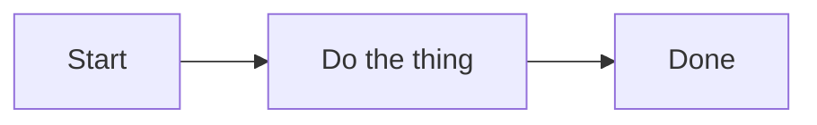

## Lab details

Write the step content here in Markdown. GitHub-flavored Markdown, fenced code
blocks (with syntax highlighting), and ```mermaid diagrams are all supported.



## Key ideas

- Point one
- Point two
