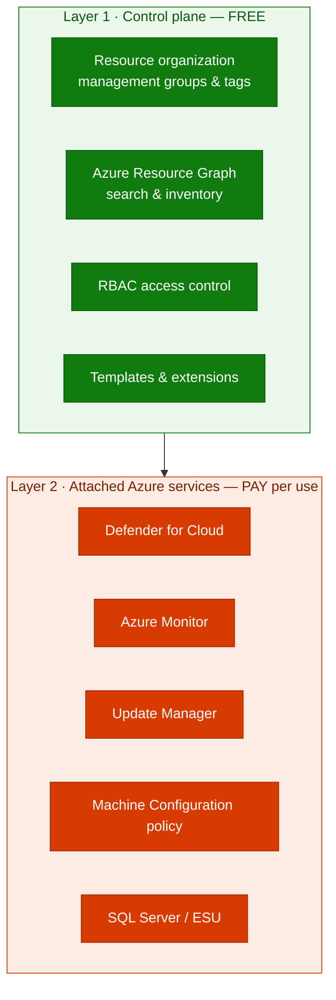

## Lab details

| Level | Persona | Duration | Purpose |
|-------|---------|----------|---------|
| 100 | IT pro / architect (new to Arc) | 20 min | After this lab you can explain what Azure Arc is, the problem it solves, and the resource types it can project into Azure. |

## Why this matters

Most organizations no longer run everything in a single place. Workloads are spread
across **on-premises datacenters, multiple public clouds, and edge locations**. Each
environment brings its **own tools**, its own identity model, and its own way of
applying policy and security — which multiplies operational cost and risk.

Common challenges Azure Arc solves:

- *"I have servers in three clouds and on-prem — I need one inventory and one policy engine."*
- *"My auditors want consistent security baselines everywhere, not per-environment scripts."*
- *"I want to use Azure Monitor, Defender for Cloud, and Update Manager on machines that aren't in Azure."*

## Introduction

> Azure Arc simplifies governance and management by delivering a **consistent
> multicloud and on-premises management platform**. — *Microsoft Learn, [Azure Arc overview](https://learn.microsoft.com/azure/azure-arc/overview)*

Azure Arc **extends the Azure control plane** (Azure Resource Manager) to resources
that live outside Azure. Once a resource is *projected* into Azure Resource Manager,
you manage it **the same way you manage a native Azure resource**: it gets an Azure
Resource ID, lives in a resource group, can be tagged, secured with RBAC, and
targeted by Azure Policy.

*Azure Arc projects non-Azure resources into Azure Resource Manager, giving you a single control plane. Source: Microsoft Learn.*

Azure Arc is a key part of Microsoft's **adaptive cloud** approach: run and manage
apps and services consistently across Azure, other clouds, on-premises, and the edge.

## Core concepts

| Concept | What it means |
|---------|---------------|
| **Control plane** | Azure Resource Manager (ARM) — the API and management layer Azure Arc extends to external resources. |
| **Projection** | Representing a non-Azure resource (server, cluster, database) as a first-class Azure resource with an Azure Resource ID. |
| **Azure Connected Machine agent** (`azcmagent`) | The lightweight agent installed on a Windows/Linux machine that registers it with Azure Arc and enables management. |
| **Hybrid machine** | A physical or virtual server hosted outside Azure that is projected into Azure via Arc. |
| **Extensions** | Add-on capabilities (e.g., the Azure extension for SQL Server, Monitoring agent, Defender) deployed onto Arc-enabled machines. |
| **Custom locations / resource bridge** | An abstraction layer that lets Azure services deploy into on-prem infrastructure (used by VMware, SCVMM, Azure Local). |

## What Azure Arc can manage

Azure Arc lets you manage several resource types hosted **outside** of Azure:

1. **Servers and virtual machines** — Windows and Linux physical servers and VMs, on-prem or in other clouds. *(Focus of this workshop.)*
2. **Kubernetes clusters** — any CNCF-conformant cluster, wherever it runs.
3. **SQL Server** — SQL Server instances *enabled by Azure Arc* (Lab 03 and 04).
4. **Azure data services** — e.g., SQL Managed Instance and PostgreSQL running on Arc-enabled Kubernetes.
5. **VMware vSphere, SCVMM, and Azure Local** — extend Azure to entire virtualization estates via the Arc resource bridge.

**Azure Arc-enabled servers** is the entry point for machines. When you connect a
machine, it becomes an Azure resource you can organize into resource groups, apply
policy to, run scripts on, and tag for search — all from the Azure portal or Azure CLI.

## How connectivity works

The Connected Machine agent only needs **outbound HTTPS (443)** to a defined set of
Azure endpoints. **No inbound ports** are required, which is why Arc works behind
corporate firewalls and NAT. Connectivity can be direct, via a proxy, or through
**Azure Arc gateway / Private Link** for locked-down networks.

*The Connected Machine agent communicates outbound to Azure Resource Manager. Source: Microsoft Learn.*

## Azure Arc cost structure

Azure Arc uses a **two-layer** cost model: the **control plane is free**, and you only
pay for **Azure services you choose to attach** to your Arc-enabled resources.

### Layer 1 — Control plane (no extra cost)

The core Azure Arc control plane for servers is **free**:

| Free capability | What it covers |
|-----------------|----------------|
| Resource organization | Azure management groups and tags |
| Search & indexing | Azure Resource Graph |
| Access & security | Azure role-based access control (RBAC) |
| Automation | ARM/Bicep/Terraform templates and extensions |
| Onboarding | Projecting the machine as an Azure resource ($0/hour meter) |

*Source: [Azure Arc overview → Pricing](https://learn.microsoft.com/azure/azure-arc/overview#pricing) and [Cost governance for Arc-enabled servers](https://learn.microsoft.com/azure/cloud-adoption-framework/scenarios/hybrid/arc-enabled-servers/eslz-cost-governance).*

### Layer 2 — Attached Azure services (pay per use)

Any Azure service you enable **on top of** Arc is billed at that service's own rate:
Microsoft Defender for Cloud, Azure Monitor, Microsoft Sentinel, Azure Update Manager,
Azure Policy **machine configuration**, Azure Automation, Key Vault, and Private Link.

### Representative public prices

Retrieved live from the **Azure Retail Prices API** (`prices.azure.com`) on **2026-07-08**,
USD, list price — actual cost varies by region, currency, and agreement.
{: .notice--info}

| Meter (Azure Retail Prices API) | Public list price |
|---------------------------------|-------------------|
| Arc control plane for servers | **Free** ($0) |
| Machine configuration – guest policy per server | ~$6.00 / server / month |
| Arc for Kubernetes – policy | $3.00 / vCPU / month |
| Arc on SCVMM – Basic | $2.50 / physical core / month |
| SQL Server enabled by Arc – **Standard**, pay-as-you-go | $0.10 / vCore / hour |
| SQL Server enabled by Arc – **Enterprise**, pay-as-you-go | $0.375 / vCore / hour |
| SQL Server **ESU** (2014/2016), Standard | $0.19 / vCore / hour |
| Windows Server 2012 **ESU** (Standard) via Arc | ~$0.0065 / core / hour |

The licensing/cost model for physical-core coverage (e.g., ESU with unlimited
virtualization) is illustrated here:

*Physical-core licensing with unlimited virtualization for SQL Server ESUs. Source: Microsoft Learn.*

**Tip:** Start free — onboard machines and build inventory, RBAC, and policy at **no control-plane cost**.
Turn on paid services (Defender, Monitor, ESU, SQL PAYG) deliberately. Estimate combined costs with the
[Azure Pricing Calculator](https://azure.microsoft.com/pricing/calculator/) and the
[Azure Arc pricing page](https://azure.microsoft.com/pricing/details/azure-arc/).

## Summary of targets

By the end of this lab you should be able to:

- Explain the problem Azure Arc solves (fragmented multicloud/hybrid management).
- Describe the control-plane / projection model.
- List the resource types Azure Arc can manage.
- Describe how the Connected Machine agent connects (outbound-only).

## Test your understanding

1. In one sentence, what does Azure Arc *extend* to resources outside Azure?
2. Which agent do you install on a server to project it into Azure Arc?
3. True or false: Azure Arc requires you to open inbound firewall ports on your servers.
4. Name three Azure capabilities you could apply to an Arc-enabled server.

  
Answers

1. The **Azure control plane** (Azure Resource Manager) — its management, governance, and security capabilities.
2. The **Azure Connected Machine agent** (`azcmagent`).
3. **False.** Only **outbound HTTPS (443)** is required; no inbound ports.
4. Any three of: Azure Policy, RBAC, tags, Azure Monitor, Defender for Cloud, Update Manager, Run Command, Machine Configuration.

## Summary of learnings

- Azure Arc **projects** non-Azure resources into Azure Resource Manager.
- You then manage them with **familiar Azure tools** — one pane of glass.
- It is **agent-based and outbound-only**, making it firewall-friendly.
- Arc supports **servers, Kubernetes, SQL Server, data services, and full VM estates**.
