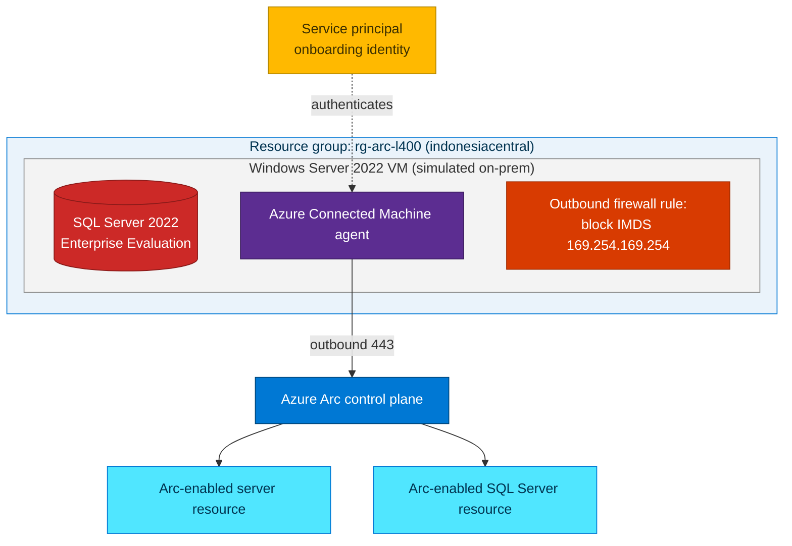

## Lab details

| Level | Persona | Duration | Purpose |
|-------|---------|----------|---------|
| 400 | Cloud engineer / architect | 60 min | Use `az` CLI to deploy a Windows Server VM with **SQL Server Enterprise (Evaluation/trial)**, then **simulate** an on-premises server and project both the machine and SQL into Azure Arc in **Indonesia Central**. |

## Why this matters

You rarely have a spare physical server for a demo. This lab builds a **self-contained,
repeatable simulation** entirely from the Azure CLI: an Azure VM stands in for an
"on-premises" server so you can practice the full Arc onboarding flow end-to-end, then
tear it all down.


*The onboarding flow: install the Connected Machine agent, then the machine is projected and manageable from Azure. Source: Microsoft Learn (Cloud Adoption Framework).*

## Architecture of this lab



<div class="notice--danger" markdown="1">
**Why block the IMDS endpoint?** The Connected Machine agent detects when it runs on an
Azure VM and **refuses to onboard** (Azure VMs are already Azure resources). To *simulate*
an on-premises machine, the bootstrap script blocks outbound access to the Azure Instance
Metadata Service (`169.254.169.254`) so the agent treats the VM as a hybrid machine. This
is a **lab-only** technique — never do this on a production Azure VM.
</div>

## Prerequisites

- Azure CLI **2.53+** and logged in: `az login`.
- Rights to create resource groups, VMs, **service principals**, and **role assignments**.
- The **Indonesia Central** region enabled on your subscription (it is a standard public region).
- ~4 vCPU quota for the `Standard_D4s_v5` size in `indonesiacentral` (adjust size if needed).

<div class="notice--info" markdown="1">
**SQL edition:** This lab installs **SQL Server 2022 Evaluation**, which is the full
**Enterprise** feature set for a **180-day trial**. Because it has no Software Assurance,
you onboard it to Arc with license type **`LicenseOnly`**.
</div>

---

## Use case 1 · Provision the environment (`az` CLI)

### Step 1 — Set variables and register providers

```bash
#!/usr/bin/env bash
set -euo pipefail

# ---- Configuration ---------------------------------------------------------
export LOCATION="indonesiacentral"
export RG="rg-arc-l400"
export VM_NAME="arc-sql-sim"
export VM_SIZE="Standard_D4s_v5"
export ADMIN_USER="arcadmin"
# Use a strong password; you will be prompted rather than hard-coding it.
read -rsp "Enter a strong VM admin password: " ADMIN_PASSWORD; echo
export ADMIN_PASSWORD

export SUBSCRIPTION_ID="$(az account show --query id -o tsv)"
export TENANT_ID="$(az account show --query tenantId -o tsv)"

# ---- Register the resource providers Azure Arc needs -----------------------
for ns in Microsoft.HybridCompute Microsoft.GuestConfiguration \
          Microsoft.HybridConnectivity Microsoft.AzureArcData; do
  az provider register --namespace "$ns" --wait
done

# ---- Resource group --------------------------------------------------------
az group create --name "$RG" --location "$LOCATION" \
  --tags project=ArcWorkshop level=L400
```

### Step 2 — Create an onboarding service principal

The bootstrap script runs **unattended inside the VM**, so it authenticates to Arc with a
service principal scoped to the resource group.

```bash
# Create an SP with the minimal role for Arc onboarding, scoped to the RG
SP_JSON="$(az ad sp create-for-rbac \
  --name "sp-arc-l400-onboard" \
  --role "Azure Connected Machine Onboarding" \
  --scopes "/subscriptions/${SUBSCRIPTION_ID}/resourceGroups/${RG}" \
  -o json)"

export SP_APP_ID="$(echo "$SP_JSON"   | python3 -c 'import sys,json;print(json.load(sys.stdin)["appId"])')"
export SP_SECRET="$(echo "$SP_JSON"   | python3 -c 'import sys,json;print(json.load(sys.stdin)["password"])')"

# Also allow the SP to install the SQL extension / manage the Arc resource
az role assignment create \
  --assignee "$SP_APP_ID" \
  --role "Azure Connected Machine Resource Administrator" \
  --scope "/subscriptions/${SUBSCRIPTION_ID}/resourceGroups/${RG}"
```

<div class="notice--warning" markdown="1">
**Warning:** Treat `SP_SECRET` as a credential. Do not commit it or echo it into logs. In production,
prefer short-lived onboarding and rotate/delete the SP after use (see Cleanup).
</div>

### Step 3 — Deploy the Windows Server VM

```bash
az vm create \
  --resource-group "$RG" \
  --name "$VM_NAME" \
  --image "MicrosoftWindowsServer:WindowsServer:2022-datacenter-azure-edition:latest" \
  --size "$VM_SIZE" \
  --admin-username "$ADMIN_USER" \
  --admin-password "$ADMIN_PASSWORD" \
  --public-ip-sku Standard \
  --nsg-rule NONE \
  --tags project=ArcWorkshop level=L400

# Optional: open RDP (3389) ONLY from your current public IP for manual inspection
MYIP="$(curl -s https://api.ipify.org)"
az vm open-port --resource-group "$RG" --name "$VM_NAME" \
  --port 3389 --priority 1000 --source-ip-address "$MYIP"
```

<div class="notice--success" markdown="1">
**Tip:** For a hardened setup, skip `az vm open-port` and use **Azure Bastion** or **`az vm run-command`**
(used below) instead of exposing RDP.
</div>

---

## Use case 2 · Install SQL + onboard to Azure Arc (in-guest bootstrap)

The following PowerShell script runs **inside the VM**. It:

1. Blocks the Azure IMDS endpoint (so the agent treats the VM as on-prem).
2. Downloads and silently installs **SQL Server 2022 Evaluation (Enterprise features)**.
3. Installs the **Azure Connected Machine agent**.
4. Connects the machine to Azure Arc using the service principal.
5. Installs the **Azure extension for SQL Server** with `LicenseType = LicenseOnly`.

### Step 4 — Create the bootstrap script

Save as `bootstrap.ps1`:

```powershell
param(
    [Parameter(Mandatory)][string]$SubscriptionId,
    [Parameter(Mandatory)][string]$ResourceGroup,
    [Parameter(Mandatory)][string]$TenantId,
    [Parameter(Mandatory)][string]$Location,
    [Parameter(Mandatory)][string]$SpAppId,
    [Parameter(Mandatory)][string]$SpSecret
)

$ErrorActionPreference = "Stop"
$work = "C:\ArcLab"; New-Item -ItemType Directory -Force -Path $work | Out-Null

# 1) Simulate on-prem: block the Azure Instance Metadata Service (lab only)
New-NetFirewallRule -Name "Block-Azure-IMDS" -DisplayName "Block Azure IMDS (Arc lab)" `
    -Direction Outbound -Action Block -RemoteAddress 169.254.169.254 -Profile Any -Enabled True

# 2) Install SQL Server 2022 Evaluation (Enterprise features, 180-day trial)
#    Download the SSEI bootstrapper, fetch the media, then run an unattended install.
$ssei = Join-Path $work "SQL2022-SSEI-Eval.exe"
Invoke-WebRequest -Uri "https://go.microsoft.com/fwlink/p/?linkid=2215158" -OutFile $ssei
& $ssei /ACTION=Download /MEDIATYPE=CAB /MEDIAPATH=$work /QUIET | Out-Null

# Extract the downloaded media
$box = Get-ChildItem $work -Filter "SQLServer2022-*.exe" | Select-Object -First 1
& $box.FullName /X:"$work\media" /Q | Out-Null

# Unattended, evaluation edition, default instance (MSSQLSERVER)
& "$work\media\setup.exe" /Q /ACTION=Install /FEATURES=SQLENGINE `
    /INSTANCENAME=MSSQLSERVER /SQLSVCACCOUNT="NT AUTHORITY\NETWORK SERVICE" `
    /SQLSYSADMINACCOUNTS="BUILTIN\Administrators" /TCPENABLED=1 `
    /IACCEPTSQLSERVERLICENSETERMS /UPDATEENABLED=0
# No product key supplied => Evaluation (Enterprise) edition.

# 3) Install the Azure Connected Machine agent
$msi = Join-Path $work "AzureConnectedMachineAgent.msi"
Invoke-WebRequest -Uri "https://aka.ms/AzureConnectedMachineAgent" -OutFile $msi
Start-Process msiexec.exe -ArgumentList "/i `"$msi`" /qn" -Wait

$azcm = "$env:ProgramFiles\AzureConnectedMachineAgent\azcmagent.exe"

# 4) Connect the "server" to Azure Arc via the onboarding service principal
& $azcm connect `
    --service-principal-id  $SpAppId `
    --service-principal-secret $SpSecret `
    --tenant-id       $TenantId `
    --subscription-id $SubscriptionId `
    --resource-group  $ResourceGroup `
    --location        $Location `
    --tags "Project=ArcWorkshop,Level=L400,Simulated=true"

Write-Host "Machine onboarded. Agent status:"
& $azcm show
```

### Step 5 — Run the bootstrap inside the VM

Push and execute the script with `az vm run-command` (no RDP needed):

```bash
az vm run-command invoke \
  --resource-group "$RG" \
  --name "$VM_NAME" \
  --command-id RunPowerShellScript \
  --scripts @bootstrap.ps1 \
  --parameters \
      "SubscriptionId=$SUBSCRIPTION_ID" \
      "ResourceGroup=$RG" \
      "TenantId=$TENANT_ID" \
      "Location=$LOCATION" \
      "SpAppId=$SP_APP_ID" \
      "SpSecret=$SP_SECRET"
```

<div class="notice--info" markdown="1">
SQL installation + agent onboarding can take several minutes. `az vm run-command` waits
for completion and returns the script output, including `azcmagent show` status.
</div>

### Step 6 — Enable SQL Server on the Arc machine

Now install the **Azure extension for SQL Server** and declare the **Evaluation** license
type (`LicenseOnly`):

```bash
az connectedmachine extension create \
  --machine-name "$VM_NAME" \
  --name "WindowsAgent.SqlServer" \
  --resource-group "$RG" \
  --location "$LOCATION" \
  --type "WindowsAgent.SqlServer" \
  --publisher "Microsoft.AzureData" \
  --settings '{"SqlManagement":{"IsEnabled":true},"LicenseType":"LicenseOnly","ExcludedSqlInstances":[]}'
```

---

## Verify the result

```bash
# 1) The simulated server is an Arc-enabled server
az connectedmachine show \
  --name "$VM_NAME" --resource-group "$RG" \
  --query "{name:name, status:status, os:osName, region:location}" -o table

# 2) The SQL extension is installed
az connectedmachine extension list \
  --machine-name "$VM_NAME" --resource-group "$RG" -o table

# 3) The Arc-enabled SQL Server instance resource exists
az resource list \
  --resource-group "$RG" \
  --resource-type "Microsoft.AzureArcData/sqlServerInstances" -o table
```

In the portal: **Azure Arc → Servers** shows `arc-sql-sim` as **Connected**, and
**Azure Arc → SQL Server instances** shows the Evaluation-edition instance in
**Indonesia Central**.

<div class="notice--success" markdown="1">
**Tip:** Explore the value from Labs 01–02: try **Azure Policy**, **Update Manager**, and
**Defender for Cloud** against your new Arc-enabled server and SQL instance.
</div>

---

## Clean up

Delete everything to avoid ongoing charges and to remove the onboarding credential:

```bash
# Remove the resource group and all resources in it
az group delete --name "$RG" --yes --no-wait

# Delete the onboarding service principal
az ad sp delete --id "$SP_APP_ID"
```

<div class="notice--warning" markdown="1">
**Warning:** `az group delete` permanently removes the VM, disks, network, and Arc resources in
`rg-arc-l400`. Make sure you're targeting the lab resource group before running it.
</div>

---

## Test your understanding

1. Why must the bootstrap script **block `169.254.169.254`** before onboarding?
2. Which **license type** matches SQL Server **Evaluation** edition, and why?
3. Which identity does the in-guest script use to run `azcmagent connect` unattended?
4. What single command **removes all lab resources**?

<details markdown="block">
  <summary>Answers</summary>

1. The agent detects Azure VMs via the **Instance Metadata Service** and refuses to onboard them; blocking IMDS makes the VM look like an on-prem/hybrid machine so the lab can proceed.
2. **`LicenseOnly`** — Evaluation has **no Software Assurance**, so it maps to the license-only tier.
3. A **service principal** with the *Azure Connected Machine Onboarding* role, passed via `--service-principal-id/-secret`.
4. `az group delete --name "$RG" --yes` (plus `az ad sp delete` to remove the SP).

</details>

## Summary of learnings

- You built a **fully scripted** Arc simulation with the Azure CLI in **Indonesia Central**.
- The **IMDS-block** technique lets an Azure VM stand in for an on-premises server.
- SQL Server **Evaluation (Enterprise features)** onboards with **`LicenseOnly`**.
- Onboarding is repeatable and disposable — **deploy, demo, delete**.
