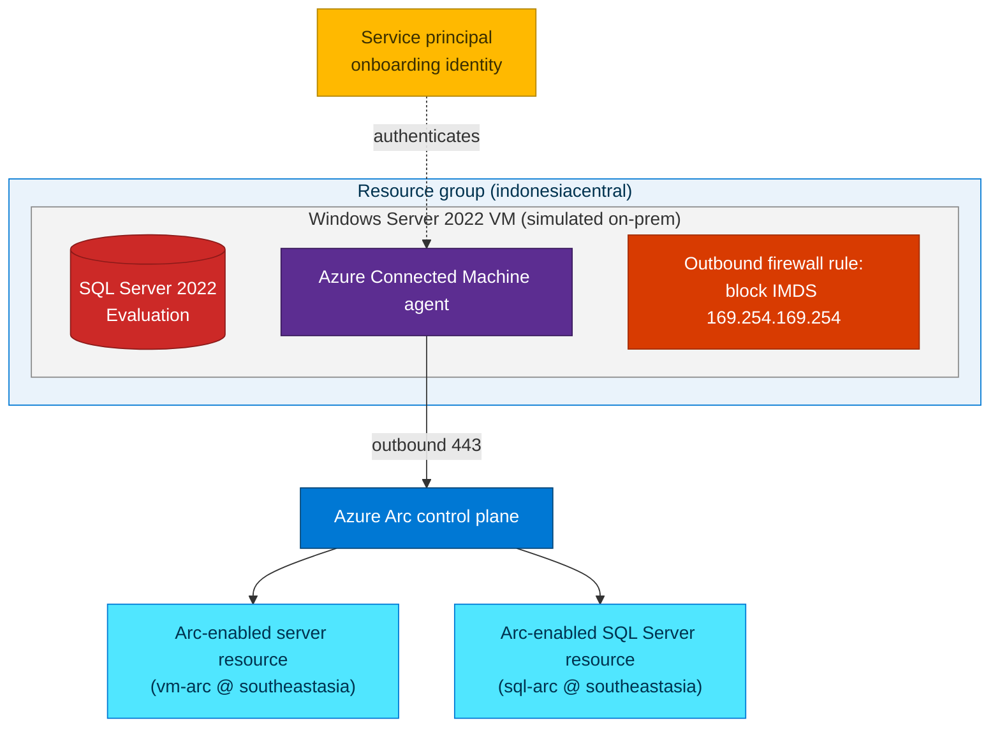

## Lab details

| Level | Persona | Duration | Purpose |
|-------|---------|----------|---------|
| 400 | Cloud engineer / architect | 60 min | Read and run one PowerShell script — [`evaluate-arc-on-azure-vm.ps1`](https://github.com/ibranibeny/azure-arc-workshop/blob/main/scripts/evaluate-arc-on-azure-vm.ps1) — that deploys a Windows Server VM with **SQL Server Evaluation**, **simulates** an on-premises server, and projects both the machine and SQL into Azure Arc. This lab explains the script **block by block**. |

## Why this matters

You rarely have a spare physical server for a demo. This lab builds a **self-contained,
repeatable simulation** from a single script: an Azure VM stands in for an "on-premises"
server so you can practice the full Arc onboarding flow end-to-end, then tear it all down.
Instead of copy-pasting commands, you'll **understand every block** of the script so you
can adapt it.


*The onboarding flow: install the Connected Machine agent, then the machine is projected and manageable from Azure. Source: Microsoft Learn (Cloud Adoption Framework).*

## Get the script

```powershell
git clone https://github.com/ibranibeny/azure-arc-workshop.git
cd azure-arc-workshop/scripts
# One command runs the whole flow (auto-generates a random admin password):
./evaluate-arc-on-azure-vm.ps1 -ResourceGroup rg-arc-eval -OpenAllInboundPorts
# Tear everything down when finished:
./evaluate-arc-on-azure-vm.ps1 -ResourceGroup rg-arc-eval -Cleanup
```

The rest of this lab walks through **what each block of that script does** and why.

## Architecture of this lab



<div class="notice--danger" markdown="1">
**Why block the IMDS endpoint?** The Connected Machine agent detects when it runs on an
Azure VM and **refuses to onboard** (Azure VMs are already Azure resources). To *simulate*
an on-premises machine, the bootstrap script blocks outbound access to the Azure Instance
Metadata Service (`169.254.169.254`) so the agent treats the VM as a hybrid machine. This
is a **lab-only** technique — never do this on a production Azure VM.
</div>

## Prerequisites

- Azure CLI **2.53+** and logged in: `az login`.
- **PowerShell 7+ (`pwsh`)** or **Windows PowerShell 5.1** to run the script.
- Rights to create resource groups, VMs, **service principals**, and **role assignments**.
- ~4 vCPU quota for the `Standard_D4s_v5` size in `indonesiacentral` (adjust `-VmSize` if needed).

<div class="notice--info" markdown="1">
**Two regions, on purpose.** The physical VM is created in **`indonesiacentral`** (`-Location`),
but the **Arc server resource and the SQL-Arc extension are registered in `southeastasia`**
(`-ArcLocation`). *SQL Server enabled by Azure Arc* isn't offered in Indonesia Central, and the
Arc resource region is metadata that [may differ from the machine's physical location](https://learn.microsoft.com/azure/azure-arc/servers/onboard-service-principal#install-the-agent-and-connect-to-azure).
</div>

<div class="notice--info" markdown="1">
**SQL edition:** This lab installs **SQL Server 2022 Evaluation** — the full **Enterprise**
feature set for a **180-day trial**. Because it has no Software Assurance, the script onboards
it to Arc with license type **`LicenseOnly`**.
</div>

---

## Code walkthrough — block by block

The whole flow lives in one file: [`scripts/evaluate-arc-on-azure-vm.ps1`](https://github.com/ibranibeny/azure-arc-workshop/blob/main/scripts/evaluate-arc-on-azure-vm.ps1). Here's what each block does.

### Block 1 — Parameters

```powershell
param(
    [string]$Location       = "indonesiacentral",   # physical VM + RG + NSG
    [string]$ArcLocation    = "southeastasia",       # Arc server + SQL-Arc resources
    [string]$ResourceGroup  = "rg-arc-eval",
    [string]$VmName         = "arc-eval-sql",
    [string]$VmSize         = "Standard_D4s_v5",
    [string]$AdminUser      = "azureuser",
    [string]$AdminPassword,                          # optional; auto-generated if omitted
    [string]$SpName         = "sp-arc-eval",
    [switch]$OpenAllInboundPorts,                    # INSECURE — lab only
    [switch]$SkipSql,                                # VM + Arc only, no SQL
    [switch]$Cleanup                                 # delete everything and exit
)
```

The key design choice: **`-Location` and `-ArcLocation` are separate**, so the VM can live in
Indonesia Central while the Arc/SQL resources land in a supported region.

### Block 2 — Error handling for `az`

```powershell
$ErrorActionPreference = "Continue"
```

Azure CLI writes progress and warnings to **stderr**. Under `Stop`, Windows PowerShell 5.1
would turn that into a terminating error, so the script uses `Continue` and checks
`$LASTEXITCODE` explicitly after each `az` call.

### Block 3 — Helper: `Assert-Az`

```powershell
function Assert-Az {
    if (-not (Get-Command az ...)) { throw "Azure CLI (az) not found. ..." }
    az account show 1>$null 2>$null
    if ($LASTEXITCODE -ne 0) { throw "Not signed in to Azure. Run 'az login' first." }
}
```

A fail-fast preflight: confirms `az` is installed **and** you're signed in before anything is created.

### Block 4 — Helper: `Test-Vm` (idempotency)

```powershell
function Test-Vm {
    az vm show -g $ResourceGroup -n $VmName 2>$null | Out-Null
    if ($LASTEXITCODE -eq 0) { ...start it if stopped...; return $true }
    return $false
}
```

Makes the script **re-runnable**: if the VM already exists it's reused (and started if
needed) instead of failing.

### Block 5 — Helper: `Invoke-InGuest` (no RDP/SSH)

```powershell
function Invoke-InGuest {
    param([string]$ScriptText, [string]$Label)
    ...write $ScriptText to a temp .ps1...
    az vm run-command invoke -g $ResourceGroup -n $VmName `
        --command-id RunPowerShellScript --scripts "@$ps1" -o none
}
```

Every in-guest action (prep, SQL install, onboarding) is pushed with **`az vm run-command`** —
so the whole lab runs **without opening RDP**. This helper is why the run-command / Guest Agent
ordering later matters.

### Block 6 — Helper: `Open-AllInbound` (optional, insecure)

```powershell
function Open-AllInbound {
    ...find the VM's NSG...
    az network nsg rule create ... -n AllowAllInbound --priority 100 `
        --access Allow --protocol '*' --source-address-prefixes '*' ...
}
```

Only runs when you pass `-OpenAllInboundPorts`. It adds an **Allow-all** inbound NSG rule for
easy lab inspection. **Never** use this outside a throwaway lab.

### Block 7 — Cleanup shortcut

```powershell
if ($Cleanup) {
    az group delete --name $ResourceGroup --yes --no-wait
    $appId = az ad sp list --display-name $SpName --query "[0].appId" -o tsv
    if ($appId) { az ad sp delete --id $appId }
    return
}
```

Running with `-Cleanup` deletes the resource group **and** the onboarding service principal,
then exits — the exact reverse of a deployment.

### Block 8 — Step 1: resource group + VM

```powershell
az group create --name $ResourceGroup --location $Location -o none

if (-not (Test-Vm)) {
    if ([string]::IsNullOrWhiteSpace($AdminPassword)) {
        # generate a strong random password and print it once
        $AdminPassword = (-join (1..20 | % { $chars[(Get-Random ...)] })) + 'Aa9!'
        $script:PwGenerated = $true
    }
    az vm create --resource-group $ResourceGroup --name $VmName `
        --image "MicrosoftWindowsServer:WindowsServer:2022-datacenter-azure-edition:latest" `
        --size $VmSize --admin-username $AdminUser --admin-password $AdminPassword `
        --public-ip-sku Standard --nsg-rule NONE -o none
}
if ($OpenAllInboundPorts) { Open-AllInbound }
```

Creates the RG and the Windows Server 2022 VM **in `$Location` (indonesiacentral)**. If you
didn't pass `-AdminPassword`, it generates one and shows it (and prints it again in the summary).

### Block 9 — Step 2: prepare the VM to look on-prem ⭐

```powershell
$prep = @'
[System.Environment]::SetEnvironmentVariable("MSFT_ARC_TEST","true",[EnvironmentVariableTarget]::Machine)
Set-Service WindowsAzureGuestAgent -StartupType Disabled -Verbose
New-NetFirewallRule -Name BlockAzureIMDS ... -Action Block -RemoteAddress 169.254.169.254
New-NetFirewallRule -Name BlockAzureLocalIMDS ... -Action Block -RemoteAddress 169.254.169.253
'@
Invoke-InGuest -ScriptText $prep -Label "Prepare VM (MSFT_ARC_TEST, set Guest Agent Disabled, block IMDS)"
```

This is the block that **simulates an on-premises server**:

- `MSFT_ARC_TEST=true` tells `azcmagent` to allow onboarding on an Azure VM.
- Blocking **IMDS** (`169.254.169.254` / `169.254.169.253`) makes the machine look hybrid.
- The Guest Agent is only set to **`Disabled`**, **not stopped**.

<div class="notice--danger" markdown="1">
**Why not stop the Guest Agent here?** `az vm run-command` (Block 5) depends on the **running**
Guest Agent to return results. Stopping it mid-script would hang every later step. Because
`MSFT_ARC_TEST=true` already bypasses the Azure-VM guard, the agent can stay running through
onboarding — it's only truly taken down by the **reboot in Block 13**.
</div>

### Block 10 — Step 3: install SQL Server 2022 Evaluation

```powershell
$sql = @'
Invoke-WebRequest -Uri "https://go.microsoft.com/fwlink/p/?linkid=2215158" -OutFile "$w\SQL2022-SSEI-Eval.exe"
& "$w\SQL2022-SSEI-Eval.exe" /ACTION=Download /MEDIATYPE=CAB /MEDIAPATH=$w /QUIET
... /X: extract media ...
& "$w\media\setup.exe" /Q /ACTION=Install /FEATURES=SQLENGINE /INSTANCENAME=MSSQLSERVER `
    /SQLSYSADMINACCOUNTS="BUILTIN\Administrators" /TCPENABLED=1 /IACCEPTSQLSERVERLICENSETERMS
'@
Invoke-InGuest -ScriptText $sql -Label "Install SQL Server 2022 Evaluation"
```

Downloads the SSEI bootstrapper, fetches the media, and runs an **unattended install** of the
database engine. No product key ⇒ **Evaluation (Enterprise features)**. Skipped if you pass `-SkipSql`.
This is the longest step (~10–15 min).

### Block 11 — Step 4: onboard to Azure Arc

```powershell
$sp = az ad sp create-for-rbac --name $SpName --role "Azure Connected Machine Onboarding" `
        --scopes "/subscriptions/$sub/resourceGroups/$ResourceGroup" -o json | ConvertFrom-Json
...
$onboard = @"
Invoke-WebRequest -Uri https://aka.ms/AzureConnectedMachineAgent -OutFile C:\ArcLab\azcm.msi
Start-Process msiexec.exe -ArgumentList '/i C:\ArcLab\azcm.msi /qn' -Wait
& "`$env:ProgramFiles\AzureConnectedMachineAgent\azcmagent.exe" connect `
    --service-principal-id $appId --service-principal-secret $secret --tenant-id $tenant `
    --subscription-id $sub --resource-group $ResourceGroup --location $ArcLocation
"@
Invoke-InGuest -ScriptText $onboard -Label "Install Connected Machine agent and connect to Azure Arc"
```

Creates a **service principal** scoped to the RG, installs the **Connected Machine agent** in
the guest, and runs `azcmagent connect`. Note **`--location $ArcLocation`** → the **vm-arc**
resource is created in **southeastasia**. This is **Use case 1** from Lab 03, automated.

### Block 12 — Step 5: enable the SQL Server extension

```powershell
$settings = '{"SqlManagement":{"IsEnabled":true},"LicenseType":"LicenseOnly","ExcludedSqlInstances":[]}'
az connectedmachine extension create `
    --machine-name $VmName --name "WindowsAgent.SqlServer" `
    --resource-group $ResourceGroup --location $ArcLocation `
    --type "WindowsAgent.SqlServer" --publisher "Microsoft.AzureData" `
    --settings "@$sf" -o none
```

Installs the **Azure extension for SQL Server** with **`LicenseType=LicenseOnly`** (Evaluation) —
again in **`$ArcLocation` (southeastasia)**. This creates the **sql-arc** resource. This is
**Use case 2** from Lab 03, automated.

### Block 13 — Step 6: reboot to finalize

```powershell
az vm restart -g $ResourceGroup -n $VmName -o none
```

The reboot is what **actually takes the Guest Agent down** (its startup was set to `Disabled`
back in Block 9), completing the on-premises simulation — safely, *after* all run-command steps
are done.

### Block 14 — Summary output

```powershell
$arcStatus = az connectedmachine show -g $ResourceGroup -n $VmName --query status -o tsv
$power     = az vm show -d -g $ResourceGroup -n $VmName --query powerState -o tsv
$fqdn      = az vm show -d -g $ResourceGroup -n $VmName --query publicIps -o tsv
# prints: RG, VM name, VM region, Arc region, Public IP, power state,
#         Arc status, admin user, and the (auto-generated) admin password
```

The final block prints a **deployment summary** — including the public IP, the **Arc status**,
and the **credentials** (the auto-generated password is highlighted) — plus the one-line cleanup
command.

---

## Verify the result

```bash
RG="rg-arc-eval"; VM_NAME="arc-eval-sql"

# 1) The simulated server is an Arc-enabled server (registered in southeastasia)
az connectedmachine show \
  --name "$VM_NAME" --resource-group "$RG" \
  --query "{name:name, status:status, os:osName, region:location}" -o table

# 2) The SQL extension is installed on the Arc machine
az connectedmachine extension list \
  --machine-name "$VM_NAME" --resource-group "$RG" -o table

# 3) The Arc-enabled SQL Server instance resource exists
az resource list \
  --resource-group "$RG" \
  --resource-type "Microsoft.AzureArcData/sqlServerInstances" -o table
```

In the portal: **Azure Arc → Machines** shows `arc-eval-sql` as **Connected**, and
**Azure Arc → SQL Server instances** shows the Evaluation-edition instance — both in
**South East Asia** (filter *Location = all* if you don't see them). The physical VM itself
still lives in **Indonesia Central**.

<div class="notice--success" markdown="1">
**Tip:** Explore the value from Labs 01–02: try **Azure Policy**, **Update Manager**, and
**Defender for Cloud** against your new Arc-enabled server and SQL instance.
</div>

---

## Clean up

One switch reverses the whole deployment (deletes the resource group **and** the onboarding
service principal):

```powershell
./evaluate-arc-on-azure-vm.ps1 -ResourceGroup rg-arc-eval -Cleanup
```

<div class="notice--warning" markdown="1">
**Warning:** `-Cleanup` runs `az group delete` (async) on the resource group, permanently removing
the VM, disks, network, and Arc resources — plus `az ad sp delete` on `sp-arc-eval`. Make sure
you're targeting the lab resource group before running it.
</div>

---

## Test your understanding

1. Why does **Block 9** set `MSFT_ARC_TEST=true` and **block `169.254.169.254`** before onboarding?
2. Why is the Guest Agent only set to **`Disabled`** in Block 9 instead of stopped immediately?
3. Why are **`-Location`** and **`-ArcLocation`** different, and where does each resource land?
4. Which **license type** does Block 12 use for SQL Evaluation, and why?
5. What single command **removes all lab resources**?

<details markdown="block">
  <summary>Answers</summary>

1. The agent detects Azure VMs via the **Instance Metadata Service** and refuses to onboard them; `MSFT_ARC_TEST=true` bypasses that guard and blocking IMDS makes the VM look like an on-prem/hybrid machine.
2. Because `az vm run-command` needs the **running** Guest Agent to report results; stopping it mid-script would hang the SQL install and onboarding. It's actually taken down by the **reboot in Block 13**.
3. `-Location` (`indonesiacentral`) is the **physical VM/RG/NSG**; `-ArcLocation` (`southeastasia`) is where the **Arc server + SQL-Arc resources** are registered — because SQL-Arc isn't offered in Indonesia Central.
4. **`LicenseOnly`** — Evaluation has **no Software Assurance**, so it maps to the license-only tier.
5. `./evaluate-arc-on-azure-vm.ps1 -ResourceGroup rg-arc-eval -Cleanup`.

</details>

## Summary of learnings

- One script — `evaluate-arc-on-azure-vm.ps1` — deploys, simulates, onboards, and enables SQL end-to-end.
- The **IMDS-block + `MSFT_ARC_TEST`** technique lets an Azure VM stand in for an on-premises server.
- **`-Location` (VM) and `-ArcLocation` (Arc/SQL)** are deliberately split so SQL-Arc lands in a supported region.
- The Guest Agent stays **running until the final reboot** so `az vm run-command` never hangs.
- SQL Server **Evaluation (Enterprise features)** onboards with **`LicenseOnly`**.
- Onboarding is repeatable and disposable — **deploy, demo, delete** (`-Cleanup`).
