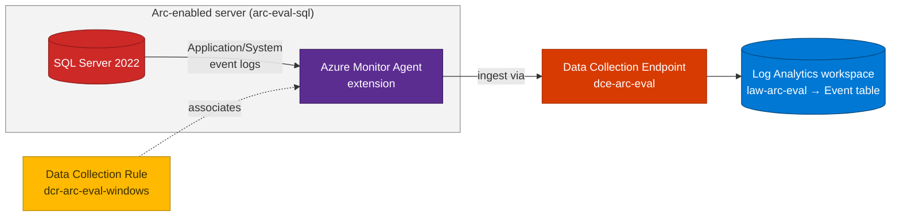

## Lab details

| Level | Persona | Duration | Purpose |
|-------|---------|----------|---------|
| 500 | Cloud engineer / SRE | 45 min | Collect Windows Application/System events (including SQL Server errors) from the Arc-enabled server you built in Lab 04 and stream them into a **Log Analytics workspace** using **Azure Monitor Agent + a Data Collection Endpoint (DCE) + a Data Collection Rule (DCR)**. |

## Why this matters

Once a machine is **Arc-enabled**, you can manage it with the same Azure Monitor pipeline as
a native Azure VM — no RDP-ing into Event Viewer on each server. This lab centralises the SQL
Server / Windows logs into one queryable workspace, which becomes the **data source** for the
AI log-analysis lab that follows (Lab 06).

## Overview — DCE and DCR

Azure Monitor Agent (AMA) doesn't decide *what* to collect or *where* to send it. Two
resources do:

| Resource | What it is | Analogy |
|----------|-----------|---------|
| **Data Collection Endpoint (DCE)** | A regional ingestion endpoint that AMA talks to. It uniquely configures ingestion settings for a region. | The **post office** the agent drops mail at. |
| **Data Collection Rule (DCR)** | Defines the **data sources** (e.g. Windows events), optional **transformations**, and the **destination** workspace/table. | The **routing slip** that says what to collect and where to deliver it. |

> **Create the DCE in the same region as your Log Analytics workspace.** A single DCE can serve many DCRs.

**How a DCR flows data** — *data sources → input streams → data flows → destinations*:


*Source: Microsoft Learn — Structure of a data collection rule.*

For Windows machines the DCR `kind` is **`Windows`** and the data source is
**`windowsEventLogs`** with the built-in `Microsoft-Event` stream, delivered to the **`Event`**
table in the workspace. You choose which logs and severities via **XPath** queries:


*Source: Microsoft Learn — Collect Windows events with Azure Monitor.*

You can view all DCRs from **Monitor → Data Collection Rules** in the portal:


*Source: Microsoft Learn — Monitor virtual machines: collect data.*

## Architecture of this lab



## Prerequisites

- Complete **[Lab 04](../04-simulate-vm-sql-arc/)** — you should already have an Arc-enabled
  server **`arc-eval-sql`** (registered in **`southeastasia`**) with SQL Server installed,
  created by `evaluate-arc-on-azure-vm.ps1`.
- Azure CLI **2.53+**, logged in (`az login`), with rights to create Monitor resources.
- Register the Monitor providers once per subscription:

```bash
az provider register --namespace Microsoft.Insights --wait
az provider register --namespace Microsoft.OperationalInsights --wait
```

<div class="notice--info" markdown="1">
**Same environment as the script.** This lab reuses the resource group and Arc machine that
`evaluate-arc-on-azure-vm.ps1` created — **`rg-arc-eval`** / **`arc-eval-sql`** in
**`southeastasia`**. Everything here (LAW, DCE, DCR) is created in that same region.
</div>

<div class="notice--warning" markdown="1">
**Required first: the SQL VM must be onboarded to Azure Arc.** Azure Monitor Agent can only
collect from a **non-Azure / on-premises** SQL Server VM once it is an **Arc-enabled server**.
The **Connected Machine agent** creates the **managed identity** that AMA uses to authenticate
to your workspace — the legacy Log Analytics agent used a workspace key, but AMA does not. So the
order is always **onboard to Arc → install AMA → associate a DCR**. **No Arc = no AMA.**<br>
Refs: [Use AMA on-premises & other clouds via Azure Arc](https://learn.microsoft.com/azure/azure-monitor/agents/azure-monitor-agent-supported-operating-systems#on-premises-and-in-other-clouds) ·
[Prepare hybrid machines](https://learn.microsoft.com/azure/azure-monitor/vm/monitor-virtual-machine-agent#prepare-hybrid-machines). Labs 03–04 already onboarded `arc-eval-sql`.
</div>


*A machine must be projected into Azure by the Connected Machine agent (Azure Arc) before AMA can stream its logs. Source: Microsoft Learn.*

---

## Step 1 — Set variables

```bash
export RG="rg-arc-eval"
export LOCATION="southeastasia"          # same region as the Arc resource
export VM_NAME="arc-eval-sql"
export LAW_NAME="law-arc-eval"
export DCE_NAME="dce-arc-eval"
export DCR_NAME="dcr-arc-eval-windows"
export SUB="$(az account show --query id -o tsv)"

# Resource ID of the Arc-enabled server (Microsoft.HybridCompute/machines)
export ARC_ID="/subscriptions/${SUB}/resourceGroups/${RG}/providers/Microsoft.HybridCompute/machines/${VM_NAME}"
```

## Step 2 — Create the Log Analytics workspace

```bash
az monitor log-analytics workspace create \
  --resource-group "$RG" --workspace-name "$LAW_NAME" \
  --location "$LOCATION" --retention-time 30

export LAW_ID="$(az monitor log-analytics workspace show \
  -g "$RG" -n "$LAW_NAME" --query id -o tsv)"
```

## Step 3 — Create the Data Collection Endpoint (DCE)

```bash
az monitor data-collection endpoint create \
  --resource-group "$RG" --name "$DCE_NAME" \
  --location "$LOCATION" --public-network-access Enabled

export DCE_ID="$(az monitor data-collection endpoint show \
  -g "$RG" -n "$DCE_NAME" --query id -o tsv)"
```

## Step 4 — Install Azure Monitor Agent on the Arc machine

AMA is a **connected-machine extension** on an Arc server (publisher `Microsoft.Azure.Monitor`):

```bash
az connectedmachine extension create \
  --machine-name "$VM_NAME" --resource-group "$RG" --location "$LOCATION" \
  --name "AzureMonitorWindowsAgent" \
  --publisher "Microsoft.Azure.Monitor" \
  --type "AzureMonitorWindowsAgent" \
  --enable-auto-upgrade true
```

## Step 5 — Create the Data Collection Rule (DCR)

Write a `Windows` DCR that collects **Application** and **System** events at **Warning/Error/
Critical** and sends them to the **`Event`** table. Save as `dcr-arc.json`:

```bash
cat > dcr-arc.json << JSON
{
  "location": "$LOCATION",
  "kind": "Windows",
  "properties": {
    "dataCollectionEndpointId": "$DCE_ID",
    "dataSources": {
      "windowsEventLogs": [
        {
          "name": "appSystemEvents",
          "streams": [ "Microsoft-Event" ],
          "xPathQueries": [
            "Application!*[System[(Level=1 or Level=2 or Level=3)]]",
            "System!*[System[(Level=1 or Level=2 or Level=3)]]"
          ]
        }
      ]
    },
    "destinations": {
      "logAnalytics": [
        { "name": "law-dest", "workspaceResourceId": "$LAW_ID" }
      ]
    },
    "dataFlows": [
      { "streams": [ "Microsoft-Event" ], "destinations": [ "law-dest" ] }
    ]
  }
}
JSON

az monitor data-collection rule create \
  --resource-group "$RG" --name "$DCR_NAME" \
  --location "$LOCATION" --rule-file dcr-arc.json

export DCR_ID="$(az monitor data-collection rule show \
  -g "$RG" -n "$DCR_NAME" --query id -o tsv)"
```

<div class="notice--info" markdown="1">
**XPath severity levels:** `1` = Critical, `2` = Error, `3` = Warning. SQL Server writes its
errors to the **Application** log with source `MSSQLSERVER` / `MSSQL$INSTANCE`, so they arrive
in the `Event` table automatically.
</div>

## Step 6 — Associate the DCR with the Arc machine

```bash
az monitor data-collection rule association create \
  --name "assoc-arc-eval-windows" \
  --rule-id "$DCR_ID" \
  --resource "$ARC_ID"
```

---

## Verify

Wait **10–15 minutes** for the first events, then query the workspace:

```bash
LAW_CUSTOMER_ID="$(az monitor log-analytics workspace show \
  -g "$RG" -n "$LAW_NAME" --query customerId -o tsv)"

az monitor log-analytics query \
  --workspace "$LAW_CUSTOMER_ID" \
  --analytics-query "Event | summarize count() by EventLevelName, Source | order by count_ desc" \
  --timespan PT1H -o table
```

Also confirm the association and AMA extension:

```bash
az monitor data-collection rule association list --resource "$ARC_ID" -o table
az connectedmachine extension list --machine-name "$VM_NAME" -g "$RG" -o table
```

In the portal: **Monitor → Data Collection Rules → dcr-arc-eval-windows → Resources** shows
`arc-eval-sql`, and **Log Analytics → Logs** returns rows from the `Event` table.

<div class="notice--success" markdown="1">
**Tip:** No SQL errors yet? Generate some — connect to the instance and run a failing query,
or stop/start the SQL service. Warning/Error events land in the `Event` table within a couple
of minutes.
</div>

---

## Overview — Azure AI Foundry (what's next)

You now have SQL/Windows logs in a workspace. In **Lab 06** you'll put an AI layer on top so you
can ask questions in plain language ("*why did errors spike yesterday?*") instead of writing KQL.

**Microsoft Foundry** is a unified Azure platform for building AI apps and agents. It groups
**models** (e.g. GPT-4o from the model catalog), **tools**, and **projects** under one resource
with built-in RBAC, tracing, and evaluations. An agent combines three parts:


*Source: Microsoft Learn — What is Microsoft Foundry Agent Service.*

| Component | Role in Lab 06 |
|-----------|----------------|
| **Model** | GPT-4o turns your question into a **KQL query** and summarises the results. |
| **Instructions** | System prompt with the `Event` table schema so answers are grounded. |
| **Tools** | **Log Analytics** (run KQL) + **Microsoft Learn MCP** (cite official docs). |

In Lab 06 you'll provision an **AI Foundry project named `evaluate-arc`** plus an Azure OpenAI
GPT-4o deployment, wired to this workspace with **managed identity** (no secrets).

---

## Test your understanding

1. What is the difference between a **DCE** and a **DCR**?
2. Which DCR **`kind`** and **data source** collect Windows events, and which **table** do they land in?
3. What do XPath levels **1**, **2**, and **3** map to?
4. Which command **links** a DCR to the Arc-enabled server?

<details markdown="block">
  <summary>Answers</summary>

1. The **DCE** is the regional ingestion endpoint AMA sends to; the **DCR** defines *what* to collect, optional transforms, and the *destination* workspace/table.
2. `kind = Windows`, data source **`windowsEventLogs`** (stream `Microsoft-Event`) → the **`Event`** table.
3. `1` = Critical, `2` = Error, `3` = Warning.
4. `az monitor data-collection rule association create --rule-id <DCR_ID> --resource <ArcMachineId>`.

</details>

## Summary of learnings

- **AMA + DCE + DCR** is the modern Azure Monitor collection pipeline — and it works identically on **Arc-enabled servers**.
- The **DCR** decides what/where; the **DCE** is the regional ingestion endpoint; keep both in the **workspace's region**.
- Windows/SQL events land in the **`Event`** table, filtered by **XPath** severity.
- This workspace is the **data source** for the AI log-analysis app in **Lab 06**.
