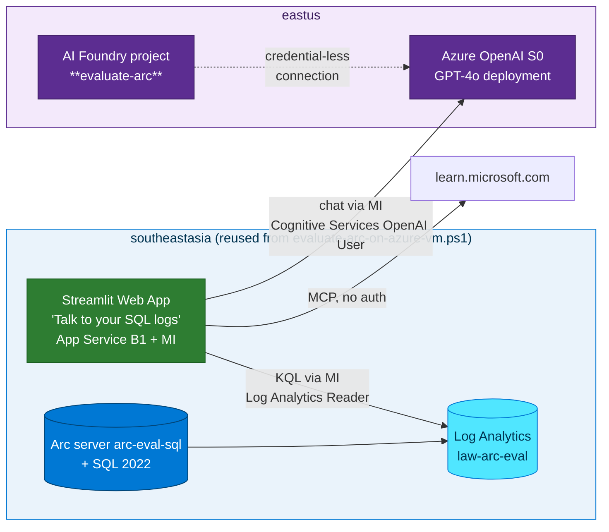

## Lab details

| Level | Persona | Duration | Purpose |
|-------|---------|----------|---------|
| 500 | Cloud engineer / AI engineer | 60 min | Put an AI layer on the Log Analytics workspace from Lab 05: provision an **Azure AI Foundry project `evaluate-arc`**, an **Azure OpenAI GPT-4o** deployment, and a **Streamlit** app so you can ask *"why did SQL errors spike yesterday?"* in plain language. Adapted from the [Analyze Your SQL Logs with Arc & AI](https://ibranibeny.github.io/AnalyzeYourSQLLogwithArc) workshop, **reusing the environment created by `evaluate-arc-on-azure-vm.ps1`**. |

## What you'll build

A natural-language log-analysis app that:

- **Centralises SQL Server logs** — AMA + DCR stream events to Log Analytics (done in Lab 05).
- **Answers questions in natural language** — GPT-4o turns *"errors in the last 24h"* into KQL.
- **Cites official docs** — the **Microsoft Learn MCP** enriches answers with documentation.
- **Uses no secrets** — **Managed Identity** for every service-to-service call.

## Architecture



## Prerequisites

- Completed **Lab 04** (Arc server `arc-eval-sql` in `rg-arc-eval` @ `southeastasia`) and
  **Lab 05** (workspace `law-arc-eval` collecting the `Event` table).
- Azure CLI **2.61+**, plus the **ML extension** for AI Foundry:

```bash
az extension add --name ml --upgrade --yes
az provider register --namespace Microsoft.CognitiveServices --wait
az provider register --namespace Microsoft.MachineLearningServices --wait
az provider register --namespace Microsoft.Web --wait
```

- **Azure OpenAI GPT-4o quota** in `eastus` (verify before starting).

<div class="notice--info" markdown="1">
**Reusing the script's environment.** Unlike the original Contoso workshop (which creates its
own VM), this lab **reuses** `rg-arc-eval` / `arc-eval-sql` / `law-arc-eval` from
`evaluate-arc-on-azure-vm.ps1` + Lab 05. You only add the **AI + app** layer here, and the AI
Foundry project is named **`evaluate-arc`**.
</div>

---

## Step 1 — Environment (adopted from `evaluate-arc-on-azure-vm.ps1`)

Create a `.env` that points at the resources the script already made. Note the split regions
(**logs in `southeastasia`**, **AI in `eastus`**) and the project name **`evaluate-arc`**:

```bash
cat > .env << 'EOF'
# --- Reused from evaluate-arc-on-azure-vm.ps1 + Lab 05 ---
export SUBSCRIPTION_ID="$(az account show --query id -o tsv)"
export RESOURCE_GROUP="rg-arc-eval"          # same RG as the script
export LOCATION_SEA="southeastasia"          # Arc + logs region (matches -ArcLocation)
export VM_NAME="arc-eval-sql"                # the Arc-enabled server
export LAW_NAME="law-arc-eval"               # workspace from Lab 05

# --- New AI layer ---
export LOCATION_US="eastus"                  # Azure OpenAI region
export AOAI_NAME="aoai-evaluate-arc"         # must be globally unique
export AOAI_DEPLOYMENT="gpt-4o"
export AOAI_MODEL="gpt-4o"
export AOAI_MODEL_VERSION="2024-08-06"
export AI_HUB_NAME="ai-hub-evaluate-arc"
export AI_PROJECT_NAME="evaluate-arc"        # <-- AI Foundry project name
export APP_PLAN_NAME="asp-evaluate-arc"
export WEBAPP_NAME="app-evaluate-arc"        # must be globally unique
EOF
source .env
```

## Step 2 — Get and revise the code

Clone the workshop repo — you'll run its scripts but **skip the VM/SQL/LAW/DCR steps** (already
done by the PowerShell script and Lab 05), and point the AI layer at `rg-arc-eval`:

```bash
git clone https://github.com/ibranibeny/AnalyzeYourSQLLogwithArc.git
cd AnalyzeYourSQLLogwithArc
# The .env above overrides the sample values so the AI layer targets rg-arc-eval / evaluate-arc.
```

<div class="notice--success" markdown="1">
**What changed vs. the original workshop:** `RESOURCE_GROUP=rg-arc-eval`, `VM_NAME=arc-eval-sql`,
`LAW_NAME=law-arc-eval`, `LOCATION_SEA=southeastasia`, and `AI_PROJECT_NAME=evaluate-arc`. Steps
1–4 of the upstream `deploy.sh` (RG, LAW, VM, DCR) are **already satisfied**, so you only run the
AI + app steps below.
</div>

## Step 3 — Azure OpenAI + GPT-4o (eastus)

```bash
az cognitiveservices account create \
  --name "$AOAI_NAME" --resource-group "$RESOURCE_GROUP" \
  --location "$LOCATION_US" --kind OpenAI --sku S0 \
  --custom-domain "$AOAI_NAME" --yes

az cognitiveservices account deployment create \
  --name "$AOAI_NAME" --resource-group "$RESOURCE_GROUP" \
  --deployment-name "$AOAI_DEPLOYMENT" \
  --model-name "$AOAI_MODEL" --model-version "$AOAI_MODEL_VERSION" \
  --model-format OpenAI --sku-name Standard --sku-capacity 30

export AOAI_ENDPOINT="$(az cognitiveservices account show \
  -n "$AOAI_NAME" -g "$RESOURCE_GROUP" --query properties.endpoint -o tsv)"
```

## Step 4 — Initiate the AI Foundry project `evaluate-arc`

Create an AI Foundry **hub** and the **project named `evaluate-arc`**, then a **credential-less
connection** to the Azure OpenAI account:

```bash
# Hub (holds shared security + connections)
az ml workspace create --kind hub \
  --name "$AI_HUB_NAME" --resource-group "$RESOURCE_GROUP" --location "$LOCATION_US"

HUB_ID="$(az ml workspace show --name "$AI_HUB_NAME" -g "$RESOURCE_GROUP" --query id -o tsv)"

# Project 'evaluate-arc' under the hub
az ml workspace create --kind project \
  --name "$AI_PROJECT_NAME" --resource-group "$RESOURCE_GROUP" \
  --location "$LOCATION_US" --hub-id "$HUB_ID"

# Credential-less (Entra ID) connection from the project to Azure OpenAI
AOAI_ID="$(az cognitiveservices account show -n "$AOAI_NAME" -g "$RESOURCE_GROUP" --query id -o tsv)"
cat > aoai-connection.yml << YAML
name: aoai-evaluate-arc
type: azure_open_ai
azure_endpoint: $AOAI_ENDPOINT
api_type: azure
resource_id: $AOAI_ID
YAML
az ml connection create --file aoai-connection.yml \
  --resource-group "$RESOURCE_GROUP" --workspace-name "$AI_PROJECT_NAME"
```

<div class="notice--info" markdown="1">
**Why a Foundry project?** The `evaluate-arc` project gives you one place to manage the model
connection, run **evaluations** on the KQL-generation prompt, and add **tracing** later — while
the Streamlit app calls GPT-4o through the same Entra identity (no keys).
</div>

## Step 5 — Streamlit app on App Service (managed identity)

```bash
# App Service plan + web app (Linux, Python)
az appservice plan create -g "$RESOURCE_GROUP" -n "$APP_PLAN_NAME" \
  --location "$LOCATION_SEA" --sku B1 --is-linux
az webapp create -g "$RESOURCE_GROUP" -p "$APP_PLAN_NAME" -n "$WEBAPP_NAME" \
  --runtime "PYTHON:3.11"

# System-assigned managed identity
az webapp identity assign -g "$RESOURCE_GROUP" -n "$WEBAPP_NAME"
APP_MI="$(az webapp identity show -g "$RESOURCE_GROUP" -n "$WEBAPP_NAME" --query principalId -o tsv)"

# App settings the Streamlit app reads
LAW_CUSTOMER_ID="$(az monitor log-analytics workspace show -g "$RESOURCE_GROUP" -n "$LAW_NAME" --query customerId -o tsv)"
az webapp config appsettings set -g "$RESOURCE_GROUP" -n "$WEBAPP_NAME" --settings \
  AZURE_OPENAI_ENDPOINT="$AOAI_ENDPOINT" \
  AZURE_OPENAI_DEPLOYMENT="$AOAI_DEPLOYMENT" \
  LAW_WORKSPACE_ID="$LAW_CUSTOMER_ID"
```

## Step 6 — Grant least-privilege RBAC (no secrets)

```bash
# App identity may call GPT-4o
az role assignment create --assignee "$APP_MI" \
  --role "Cognitive Services OpenAI User" \
  --scope "$(az cognitiveservices account show -n "$AOAI_NAME" -g "$RESOURCE_GROUP" --query id -o tsv)"

# App identity may run KQL against the workspace
az role assignment create --assignee "$APP_MI" \
  --role "Log Analytics Reader" \
  --scope "$(az monitor log-analytics workspace show -g "$RESOURCE_GROUP" -n "$LAW_NAME" --query id -o tsv)"
```

## Step 7 — Deploy the app code

```bash
cd streamlit-app
zip -r ../deploy.zip . -x "*.pyc" "__pycache__/*" ".env"
az webapp deploy -g "$RESOURCE_GROUP" -n "$WEBAPP_NAME" \
  --src-path ../deploy.zip --type zip
cd ..
```

---

## Talk to your SQL logs

Open `https://<WEBAPP_NAME>.azurewebsites.net` and ask, for example:

- *"How many errors were logged in the last 24 hours, grouped by source?"*
- *"Show the most recent SQL Server error events."*
- *"Why did errors spike yesterday, and what does Microsoft Learn recommend?"*

Under the hood: GPT-4o (via the `evaluate-arc` project connection) writes KQL → the app runs it
against `law-arc-eval` with its managed identity → GPT-4o summarises the rows and adds Microsoft
Learn citations via MCP.

Quick smoke test from the CLI:

```bash
az monitor log-analytics query \
  --workspace "$LAW_CUSTOMER_ID" \
  --analytics-query "Event | where EventLevelName in ('Error','Warning') | take 5 | project TimeGenerated, Source, RenderedDescription" \
  --timespan P1D -o table
```

---

## Clean up

The **VM/Arc/LAW** belong to the eval environment — tear those down with the PowerShell script's
`-Cleanup`. Remove **only the AI + app layer** you added here first if you want to keep the Arc lab:

```bash
# Remove just the AI layer (keep VM + monitoring)
az webapp delete -g rg-arc-eval -n "$WEBAPP_NAME"
az cognitiveservices account delete -g rg-arc-eval -n "$AOAI_NAME"
az ml workspace delete -g rg-arc-eval -n evaluate-arc --yes
az ml workspace delete -g rg-arc-eval -n "$AI_HUB_NAME" --yes

# ...or remove EVERYTHING (VM, Arc, logs, AI) via the script:
./evaluate-arc-on-azure-vm.ps1 -ResourceGroup rg-arc-eval -Cleanup
```

---

## Test your understanding

1. Which two **RBAC roles** let the app work **without secrets**, and on which resources?
2. Why are logs in **`southeastasia`** but Azure OpenAI in **`eastus`**?
3. What is the **AI Foundry project** called, and what does it hold?
4. Which upstream `deploy.sh` steps did you **skip**, and why?

<details markdown="block">
  <summary>Answers</summary>

1. **Cognitive Services OpenAI User** on the Azure OpenAI account (call GPT-4o) and **Log Analytics Reader** on the workspace (run KQL) — both granted to the web app's **managed identity**.
2. GPT-4o quota/availability is region-specific (`eastus` here); the Arc + logs stay in `southeastasia` to match the Arc resource region from the script.
3. **`evaluate-arc`** — it holds the credential-less **connection to Azure OpenAI** and is where you'd add evaluations/tracing for the KQL prompt.
4. RG, Log Analytics, VM, and DCR creation — they were already done by `evaluate-arc-on-azure-vm.ps1` and **Lab 05**, so only the AI + app layer is new.

</details>

## Summary of learnings

- You reused the **`evaluate-arc-on-azure-vm.ps1`** environment (`rg-arc-eval` / `arc-eval-sql` / `law-arc-eval`) and added an **AI layer** on top.
- An **AI Foundry project `evaluate-arc`** + **Azure OpenAI GPT-4o** turns natural language into KQL against your Arc SQL logs.
- **Managed Identity + least-privilege RBAC** means **zero secrets** in the app.
- The **Microsoft Learn MCP** grounds answers in official documentation.
