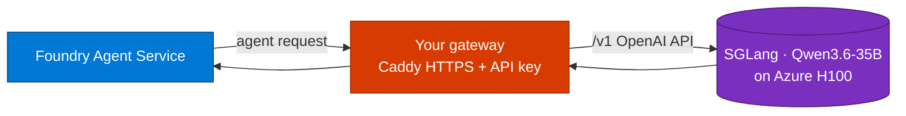

## Lab details

| Level | Persona | Duration | Purpose |
|-------|---------|----------|---------|
| 200 | AI engineer / architect | 20 min | After this lab you can explain Bring Your Own Model (BYOM), the gateway pattern, and when self-hosting inference makes sense. |

## Why this matters

Foundry's model catalog is convenient, but sometimes you need a **specific open model**,
**data residency**, or **full control of the endpoint**. Bring Your Own Model lets you keep
the model behind your own infrastructure while still building agents in Foundry.

## What "Bring Your Own Model" means

Foundry Agent Service can talk to a model that lives **behind your own gateway** — Azure
API Management or any non-Azure model gateway — instead of only the models in Foundry's
catalog. You keep the endpoint; Foundry brings the agent.

*Foundry Agent Service sends agent requests to your gateway, which forwards them to the model hosted behind it. Source: sglang-azure-workshop.*

Key benefits:

- **Keep control** of the model endpoint behind your existing infrastructure.
- **Stay private** — build agents on a model that is never exposed publicly.
- **Use your security** — the gateway enforces your own auth and policies.
- **Govern access** — apply your compliance and data-handling rules.

**Heads up:** BYOM models are third-party (non-Microsoft). You own the responsible-AI
mitigations, data-handling compliance, and license terms when you use them with Foundry.
See [Bring your own model to Foundry Agent Service](https://learn.microsoft.com/azure/foundry/agents/how-to/ai-gateway?tabs=api-management&pivots=foundry-portal).

## The reference architecture

## When to self-host inference

| Choose self-hosted inference when… | Choose the Foundry catalog when… |
|-----------------------------------|----------------------------------|
| You need a specific open model (e.g., Qwen) | A catalog model meets your needs |
| Weights must never leave your environment | Managed hosting is preferred |
| You want to control cost on your own GPU | You want pay-per-token simplicity |
| You already run an API gateway | You don't want to run infrastructure |

## Test your understanding

1. In BYOM, what stays under **your** control — the model endpoint or the agent?
2. Which component enforces authentication in this architecture?
3. Who owns the responsible-AI and licensing obligations for a BYOM model?

  
Answers

1. The **model endpoint** (behind your gateway). Foundry brings the **agent**.
2. **Your gateway** (here, Caddy with an API key).
3. **You do** — BYOM models are third-party/non-Microsoft.

## Summary of learnings

- BYOM connects a Foundry agent to a model **behind your own gateway**.
- You keep the endpoint **private, secured, and governed** by your own policies.
- Self-hosting fits specific-model, data-residency, and cost-control needs.
