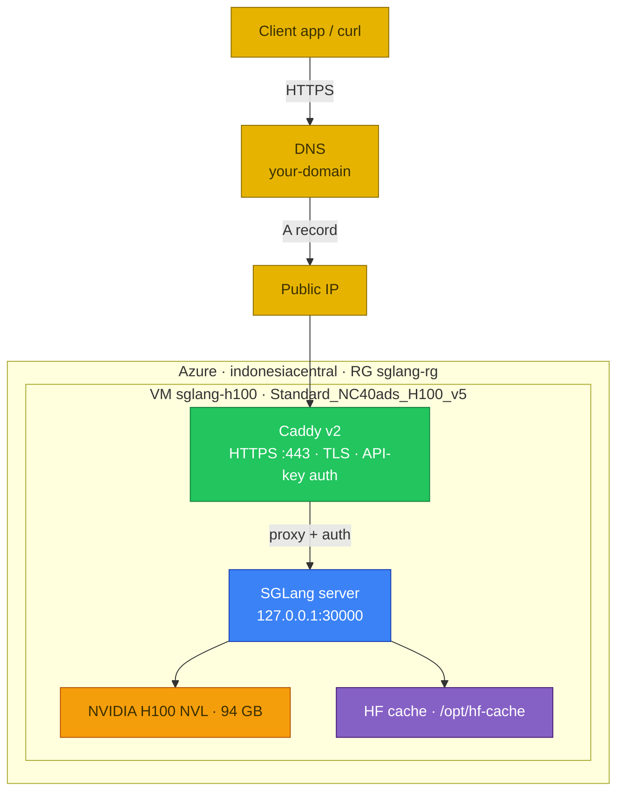
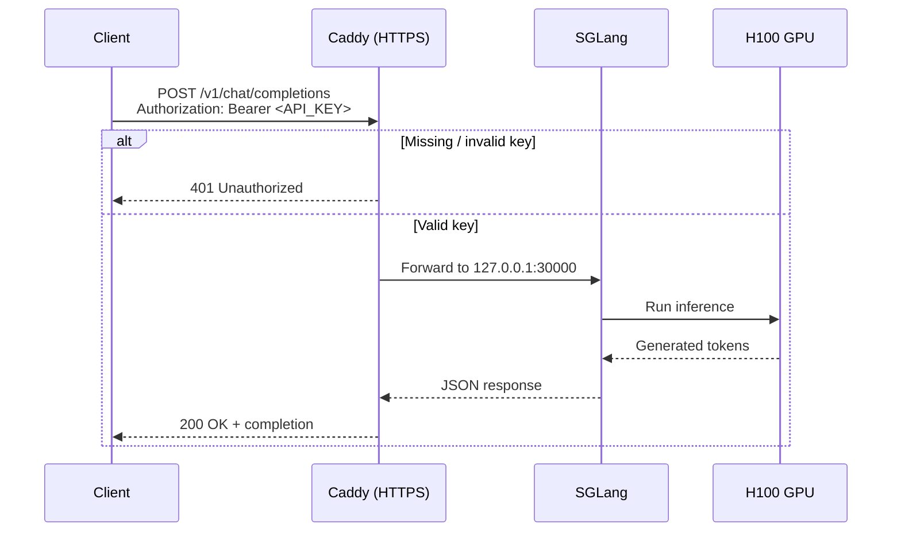
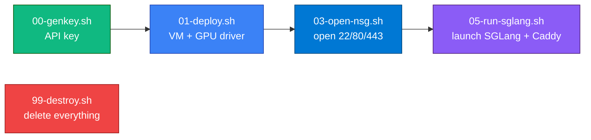

## Lab details

| Level | Persona | Duration | Purpose |
|-------|---------|----------|---------|
| 200 | AI engineer / architect | 20 min | After this lab you can explain how a self-hosted OpenAI-compatible endpoint is served from one H100 and how a request flows through it. |

## Why this matters

Before deploying, understand the moving parts: a **GPU VM** runs the model, **SGLang**
serves an OpenAI-compatible API on loopback, and **Caddy** adds HTTPS + an API key so it's
safe to expose. No weights ever leave your VM.

## Architecture

## Request flow

## Deployment scripts at a glance

## Key ideas

- **OpenAI-compatible:** SGLang exposes `/v1/chat/completions`, tool calling, and SSE
  streaming, so existing OpenAI clients work unchanged.
- **Loopback + gateway:** SGLang binds to `127.0.0.1` only; Caddy is the sole public
  surface, adding TLS and API-key auth.
- **Your data stays put:** the model weights and inference never leave your VM.

## Test your understanding

1. Which component adds HTTPS and API-key authentication?
2. What port does SGLang bind to, and is it public?
3. What happens to a request with a missing or invalid key?

  
Answers

1. **Caddy** (reverse proxy / TLS terminator).
2. `127.0.0.1:30000` — **loopback only**, not public.
3. Caddy returns **401 Unauthorized** before reaching SGLang.

## Summary of learnings

- One **H100 VM** runs SGLang; **Caddy** fronts it with HTTPS + API key.
- The endpoint is **OpenAI-compatible** under `/v1`.
- Four scripts take you from key → VM → firewall → serving.
