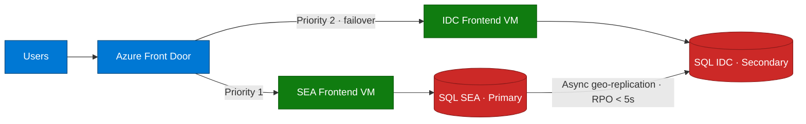

## Lab details

| Level | Persona | Duration | Purpose |
|-------|---------|----------|---------|
| 200 | Cloud architect / engineer | 20 min | After this lab you can explain the multi-region resiliency design and how automatic failover works end-to-end. |

## Why this matters

Real disaster recovery isn't just backups — it's **automatic failover with no code
changes**. This module builds a two-region app where traffic and data move to a healthy
region on their own.

## The scenario

Two regions run the same app:

- **Southeast Asia** — primary (simulating on-premises).
- **Indonesia Central** — secondary (Azure cloud).

**Azure Front Door** sends users to the primary; if the primary's health probe fails,
it routes to the secondary. **Azure SQL Failover Groups** keep the databases in sync so
the secondary can take over writes.

## Architecture at a glance

## Key components

| Component | Role |
|-----------|------|
| **Azure Front Door** | Global load balancer with `/health` probes and priority routing |
| **Azure Firewall (Basic)** | DNAT (external `:80` → VM `:80`) and inspection in each hub |
| **Hub-Spoke VNets** | Segmentation: shared services in the hub, workloads in spokes |
| **Private Endpoints** | Give PaaS Azure SQL a private IP inside the VNet — no public exposure |
| **SQL Failover Groups** | Async geo-replication + a listener endpoint that never changes |
| **Node.js app** | A small social-media CRUD demo that shows the active region |

## How failover flows

1. Users hit the **Front Door** URL.
2. Front Door health-probes both regions on `/health`.
3. Normally, **Priority 1 (SEA)** serves traffic.
4. If SEA's probe fails, Front Door shifts to **Priority 2 (IDC)** within ~30–60s.
5. The **SQL Failover Group** promotes the IDC database to primary; the **listener
   endpoint** stays the same, so the app needs **no connection-string change**.

## Test your understanding

1. Which service decides *where user traffic goes* during an outage?
2. Which service keeps the *databases in sync* across regions?
3. Why doesn't the app need a connection-string change during failover?

  
Answers

1. **Azure Front Door** (priority routing based on health probes).
2. **Azure SQL Failover Groups** (async geo-replication, RPO < 5s).
3. It connects to the **failover-group listener endpoint**, which always points to the current primary.

## Summary of learnings

- Resiliency = **Front Door** (traffic) + **Failover Groups** (data) + **hub-spoke** (network).
- Failover is **automatic** and needs **zero app code changes**.
- Private Endpoints keep SQL **off the public internet**.
