## Lab details

| Level | Persona | Duration | Purpose |
|-------|---------|----------|---------|
| 300 | Cloud engineer | 45 min | Deploy the complete multi-region resilient architecture with the Azure CLI. |

## Why this matters

You'll stand up everything — networks, firewalls, SQL with a failover group, VMs, the
app, and Front Door — in **eight phases**, either with one command or step by step.

## Deployment phases

```mermaid
%% Colored per the mermaid-diagrams skill (classDef + subgraph style)
flowchart LR
    P1[1 · Resource Groups] --> P2[2 · Hub VNets + Firewall] --> P3[3 · Spoke VNets + Peering] --> P4[4 · Route Tables + NSGs]
    P4 --> P5[5 · Azure SQL + Failover Group] --> P6[6 · Private Endpoints + DNS] --> P7[7 · VMs + App] --> P8[8 · Azure Front Door]

    classDef net fill:#0078D4,stroke:#004578,color:#ffffff;
    classDef data fill:#CC2927,stroke:#8B1A19,color:#ffffff;
    classDef app fill:#107C10,stroke:#0B5A0B,color:#ffffff;
    class P1,P2,P3,P4 net
    class P5,P6 data
    class P7,P8 app
```



## Prerequisites

| Tool | Version |
|------|---------|
| Azure CLI | 2.60+ |
| Bash | 4.0+ (WSL2 on Windows) |
| Git | 2.30+ |
| SSH key pair | `ssh-keygen -t rsa -b 4096` |

```bash
az version --output table
git --version
ssh -V
```

## 1 · Sign in and clone

```bash
az login
az account set --subscription "<YOUR_SUBSCRIPTION_ID>"

git clone https://github.com/ibranibeny/azure-resiliency-workshop.git
cd azure-resiliency-workshop
```

## 2 · Pre-flight checks

```bash
# Verify capacity for the VM size in both regions
az vm list-skus --location southeastasia   --size Standard_B2s \
  --query "[].{Name:name, Restrictions:restrictions}" --output table
az vm list-skus --location indonesiacentral --size Standard_B2s \
  --query "[].{Name:name, Restrictions:restrictions}" --output table
```

## 3 · One-command deploy

```bash
cd scripts
chmod +x 01-deploy-infrastructure.sh 02-deploy-app.sh
./01-deploy-infrastructure.sh     # phases 1–8 (Firewall Basic is the longest step)
./02-deploy-app.sh                # deploy the Node.js app to the VMs
```

Total time **~30–45 minutes** (Azure Firewall Basic provisioning takes ~10 min per region).

### What gets created

| Phase | Resource | Example names |
|-------|----------|---------------|
| 1 | Resource groups × 5 | `resiliency-rg-hub-sea`, `-spoke-sea`, `-hub-idc`, `-spoke-idc`, `-global` |
| 2 | Hub VNets + Firewall × 2 | `resiliency-vnet-hub-sea/idc` + `resiliency-fw-sea/idc` |
| 3 | Spoke VNets + peering | `resiliency-vnet-spoke-sea/idc` + 4 peerings |
| 4 | Route tables + NSGs | UDRs + subnet security |
| 5 | Azure SQL + failover group | `resiliency-sql-sea/idc` + `fg-resiliency-workshop` |
| 6 | Private Endpoints + DNS | SQL private links + private DNS zones |
| 7 | VMs × 2 + app | Node.js + Nginx + PM2 |
| 8 | Azure Front Door | `resiliencyfd` + origin groups + routes |

## Key phase commands (step-by-step option)

<div class="notice--info" markdown="1">
Prefer to learn phase by phase? These are the essential commands the scripts run.
</div>

### Phase 1 — Resource groups

```bash
az group create --name "resiliency-rg-hub-sea"   --location "southeastasia"
az group create --name "resiliency-rg-spoke-sea" --location "southeastasia"
az group create --name "resiliency-rg-hub-idc"   --location "indonesiacentral"
az group create --name "resiliency-rg-spoke-idc" --location "indonesiacentral"
az group create --name "resiliency-rg-global"    --location "eastus"
```

### Phase 2 — Hub network + firewall

```bash
az network vnet create \
  --resource-group "resiliency-rg-hub-sea" --name "resiliency-vnet-hub-sea" \
  --address-prefix "10.0.0.0/16" \
  --subnet-name "AzureFirewallSubnet" --subnet-prefix "10.0.1.0/26"

az network firewall create \
  --resource-group "resiliency-rg-hub-sea" --name "resiliency-fw-sea" \
  --sku AZFW_VNet --tier Basic --vnet-name "resiliency-vnet-hub-sea"
```

<div class="notice--warning" markdown="1">
**Azure Firewall Basic** provisioning takes **~10 minutes per region** — this is the
longest step in the deployment.
</div>

### Phase 5 — Azure SQL + failover group

```bash
az sql server create --name "resiliency-sql-sea" \
  --resource-group "resiliency-rg-spoke-sea" --location "southeastasia" \
  --admin-user "sqladmin" --admin-password "<secure-password>" \
  --enable-public-network false

az sql db create --name "socialMediaDB" --server "resiliency-sql-sea" \
  --resource-group "resiliency-rg-spoke-sea" --service-objective "GP_Gen5_2"

az sql failover-group create --name "fg-resiliency-workshop" \
  --server "resiliency-sql-sea" --partner-server "resiliency-sql-idc" \
  --add-db "socialMediaDB" --failover-policy Automatic --grace-period 60
```

### Phase 8 — Azure Front Door

```bash
az afd profile create --profile-name "resiliencyfd" \
  --resource-group "resiliency-rg-global" --sku Standard_AzureFrontDoor

az afd origin-group create --profile-name "resiliencyfd" \
  --resource-group "resiliency-rg-global" --origin-group-name "og-frontend" \
  --probe-path "/health" --probe-protocol Http --probe-request-type GET \
  --probe-interval-in-seconds 30
```

## Verify the deployment

```bash
az resource list --resource-group resiliency-rg-spoke-sea --output table

az vm list --resource-group resiliency-rg-spoke-sea \
  --query "[].{Name:name, Status:powerState}" --output table

az afd endpoint list --profile-name resiliencyfd \
  --resource-group resiliency-rg-global --query "[].hostName" --output tsv
```

## Estimated cost & cleanup

Roughly **~$0.55/hour** (2× B2s VMs, 2× Firewall Basic, 2× SQL GP_Gen5_2, Front Door).

<div class="notice--warning" markdown="1">
**Delete everything after the workshop** to avoid charges:

```bash
cd scripts && chmod +x 04-cleanup.sh && ./04-cleanup.sh
```
</div>

## Summary of learnings

- The topology deploys in **8 phases**, scriptable end-to-end.
- **Firewall Basic** is the slow step (~10 min/region).
- Always **clean up** — the running stack costs ~$0.55/hr.
