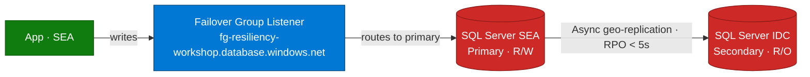

## Lab details

| Level | Persona | Duration | Purpose |
|-------|---------|----------|---------|
| 300 | Cloud engineer / DBA | 25 min | Understand and operate SQL Failover Groups and private endpoints for cross-region data availability. |

## Why this matters

Front Door moves *traffic*; **Failover Groups move the *data* primary**. The magic is the
**listener endpoint** — one hostname that always points at the current primary, so your
app never changes its connection string.

## How data synchronization works



## The connection string never changes

```bash
# Always use the Failover Group listener endpoint
SQL_SERVER=fg-resiliency-workshop.database.windows.net

# WRONG — don't use individual server names
# SQL_SERVER=resiliency-sql-sea.database.windows.net
```

The listener automatically redirects to whichever server is currently primary — **zero
application code changes** during failover.

## Failover types

| Type | Initiated by | Data loss | Use case |
|------|--------------|-----------|----------|
| **Automatic** | Azure detects outage | Possible (RPO < 5s) | Unplanned disasters |
| **Planned (manual)** | Admin | None | Maintenance windows |
| **Forced (manual)** | Admin | Possible | Urgent DR activation |

## Manual failover command

```bash
# Promote Indonesia Central to primary
az sql failover-group set-primary \
  --name "fg-resiliency-workshop" \
  --resource-group "resiliency-rg-global" \
  --server "resiliency-sql-idc"
```

## Why Private Endpoints for SQL?

Azure SQL is **PaaS** — it lives outside your VNet. A **Private Endpoint** gives it a
private IP inside your VNet:

| Aspect | Public access | Private Endpoint |
|--------|---------------|------------------|
| Traffic path | Public internet | Azure backbone (private) |
| SQL exposure | Public IP | No public IP |
| Access control | IP firewall rules | VNet-only access |
| Security | Lower | Enterprise-grade |

## Database schema (demo app)

```sql
CREATE TABLE posts (
    id UNIQUEIDENTIFIER PRIMARY KEY DEFAULT NEWID(),
    userId NVARCHAR(50) NOT NULL,
    username NVARCHAR(100) NOT NULL,
    message NVARCHAR(500) NOT NULL,
    timestamp DATETIME2 DEFAULT GETUTCDATE(),
    region NVARCHAR(50),
    updatedAt DATETIME2 NULL,
    updatedRegion NVARCHAR(50) NULL
);
```

## Test your understanding

1. What hostname should the app connect to — and why?
2. What's the approximate **RPO** for automatic failover here?
3. What does a Private Endpoint remove from Azure SQL's exposure?

<details markdown="block">
  <summary>Answers</summary>

1. The **failover-group listener** (`fg-resiliency-workshop.database.windows.net`) — it always points to the current primary.
2. **< 5 seconds** (async geo-replication).
3. Its **public IP** — access becomes VNet-only over the Azure backbone.

</details>

## Summary of learnings

- The **listener endpoint** makes failover transparent to the app.
- Failover can be **automatic, planned, or forced** — each with different data-loss risk.
- **Private Endpoints** keep PaaS SQL off the public internet.
