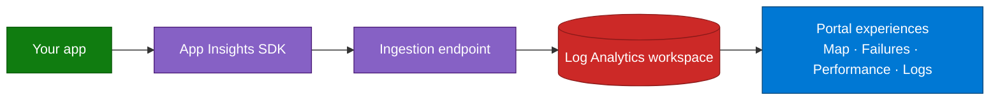

## Lab details

| Level | Persona | Duration | Purpose |
|-------|---------|----------|---------|
| 100 | Developer / SRE | 15 min | After this lab you can explain Azure Monitor, Application Insights, and the telemetry model. |

## Why this matters

You can't operate what you can't see. **Azure Monitor** and **Application Insights** give
you one place to understand health, performance, and reliability — then alert and act.

## Azure Monitor

Azure Monitor is Microsoft's **unified observability service**. It collects **metrics,
logs, traces, and events** from cloud and hybrid resources into a single platform.

*Data sources sending data to Azure Monitor features. Source: Microsoft Learn.*

## Application Insights

Application Insights is the **APM (Application Performance Monitoring)** feature of Azure
Monitor. You instrument your app with an SDK (or the OpenTelemetry distro); the SDK ships
telemetry to an ingestion endpoint, where it lands in a **Log Analytics workspace** and
becomes explorable through **Application Map, Failures, Performance, Live Metrics, and
Logs (KQL)**.

*Application Insights showing an Application Map. Source: Microsoft Learn.*

## How telemetry flows

## Telemetry types

| Type | What it captures | Log Analytics table |
|------|------------------|---------------------|
| **Request** | Each incoming HTTP call, duration, result code | `AppRequests` |
| **Dependency** | Outbound calls (HTTP, SQL, queues, in-memory) | `AppDependencies` |
| **Exception** | Handled/unhandled exceptions with stack traces | `AppExceptions` |
| **Trace** | Log lines (`ILogger`) with severity | `AppTraces` |
| **Custom event / metric** | Business events and KPIs you emit | `AppEvents` / `AppMetrics` |

## Test your understanding

1. Application Insights is a feature of which larger service?
2. Where does telemetry land so you can query it with KQL?
3. Which telemetry type records outbound SQL or HTTP calls?

  
Answers

1. **Azure Monitor** (App Insights is its APM feature).
2. A **Log Analytics workspace** (`App*` tables).
3. **Dependency** telemetry (`AppDependencies`).

## Summary of learnings

- **Azure Monitor** = unified metrics/logs/traces/events platform.
- **Application Insights** = APM: instrument → ingest → Log Analytics → portal experiences.
- Telemetry types map to the `App*` tables you'll query later.
