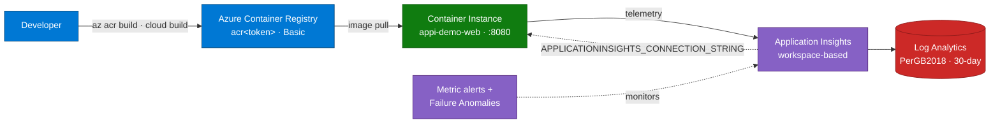

## Lab details

| Level | Persona | Duration | Purpose |
|-------|---------|----------|---------|
| 300 | Developer / cloud engineer | 30 min | Deploy the instrumented .NET 8 API to Azure and confirm real telemetry lands in Application Insights. |

## Why this matters

This is zero-to-telemetry. One PowerShell script builds the image in the cloud and stands
up the whole stack — then you generate traffic and watch it appear.

## What gets installed

Five resources in one resource group (`demo-monitor-rg`):

| # | Resource | Type | Purpose |
|---|----------|------|---------|
| 1 | `log-<token>` | Log Analytics workspace | Stores all telemetry (`App*` tables) |
| 2 | `appi-<token>` | Application Insights | APM / query surface |
| 3 | `acr<token>` | Container Registry (Basic) | Holds the image |
| 4 | `appi-demo-web` | Container Instance | Runs the app (1 vCPU / 1.5 GB, port 8080) |
| 5 | Failure Anomalies | Smart-detector alert rule | Auto-created with App Insights |

## Deployment topology



## Prerequisites

```powershell
az version                                  # Azure CLI
az extension add -n application-insights    # App Insights CLI extension
$PSVersionTable.PSVersion                    # PowerShell 5.1+

az login
az account set --subscription "<subscription-id-or-name>"
```

<div class="notice--info" markdown="1">
**No local Docker required** — the container image is built in the cloud with `az acr build`.
</div>

## Deploy (single-service, minimal)

```powershell
# Creates the RG, Log Analytics, App Insights, ACR, builds the image, runs 1 ACI.
powershell.exe -NoProfile -ExecutionPolicy Bypass -File "scripts\deploy-aci.ps1"
```

The script prints `DEPLOY_RESULT=SUCCESS` and an `APP_URL=...` line when finished. To
re-deploy reusing existing resources (faster), use `scripts\finish-aci.ps1`.

## The demo endpoints

| Endpoint | Method | What it does | Lights up |
|----------|--------|--------------|-----------|
| `/api/health` | GET | Healthy request | Performance, Live Metrics |
| `/api/products` | GET / POST | Request + in-memory dependency | Application Map (`InMemory` node) |
| `/api/simulate-error` | GET | ~30% throw an exception (HTTP 500) | Failures |
| `/api/load-test` | GET | CPU-bound work | Performance (slow op) |
| `/api/memory-test` | GET | Allocates memory + custom metric/event | Metrics, Logs |

## Generate and verify telemetry

```powershell
# Hit every endpoint (health, products, errors, load + memory tests)
powershell.exe -NoProfile -ExecutionPolicy Bypass -File "scripts\smoke-test.ps1"

# Confirm rows landed (queries the Log Analytics App* tables directly)
powershell.exe -NoProfile -ExecutionPolicy Bypass -File "scripts\check-telemetry.ps1"
```

<div class="notice--warning" markdown="1">
**Ingestion latency:** first telemetry can take **2–5 minutes** to appear. If a query is
empty, wait and re-run `check-telemetry.ps1`.
</div>

## Infrastructure-as-Code option (ARM)

Because ACI can't pull an image that doesn't exist yet, deploy in **three phases**:

```powershell
az group create --name demo-monitor-rg --location "North Europe"

# Phase 1 — registry + monitoring only (no container yet)
az deployment group create --resource-group demo-monitor-rg `
  --template-file azure-monitor-demo/infra/main.json `
  --parameters azure-monitor-demo/infra/main.parameters.json `
  --parameters deployContainerGroup=false

# Phase 2 — build & push the image (cloud build)
$acr = az deployment group show -g demo-monitor-rg -n main `
  --query "properties.outputs.containerRegistryName.value" -o tsv
az acr build --registry $acr --image webdemo:latest azure-monitor-demo/src/web

# Phase 3 — create the container now that the image exists
az deployment group create --resource-group demo-monitor-rg `
  --template-file azure-monitor-demo/infra/main.json `
  --parameters azure-monitor-demo/infra/main.parameters.json `
  --parameters deployContainerGroup=true
```

## Clean up

```powershell
az group delete --name demo-monitor-rg --yes --no-wait
```

## Summary of learnings

- One script builds in the cloud and deploys **RG → Log Analytics → App Insights → ACR → ACI**.
- The app's endpoints each emit a distinct telemetry type.
- Telemetry appears in **2–5 minutes**; verify with `check-telemetry.ps1`.
