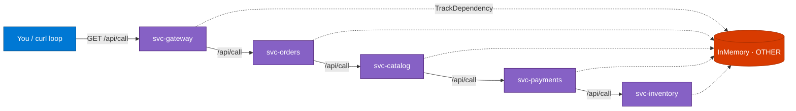

## Lab details

| Level | Persona | Duration | Purpose |
|-------|---------|----------|---------|
| 400 | Developer / SRE | 25 min | Deploy a 5-service mesh, generate a distributed trace, and interpret the Application Map. |

## Why this matters

A single node is a nice start, but real systems are distributed. This lab deploys **five
interconnected services** so the Application Map renders a true multi-node topology — and
teaches you to read every number on it.

## The mesh

Five container instances run the **same image**, each with a distinct `cloud_RoleName`:
`svc-gateway`, `svc-orders`, `svc-payments`, `svc-catalog`, `svc-inventory`. One endpoint —
`GET /api/call` — turns them into a real distributed system.



## Deploy and drive traffic

```powershell
# 1. Build the image once and create all 5 wired-up ACIs
powershell.exe -NoProfile -ExecutionPolicy Bypass -File "scripts\deploy-mesh-aci.ps1"

# 2. Drive traffic through the gateway (cascades through the whole chain)
powershell.exe -NoProfile -ExecutionPolicy Bypass -File "scripts\mesh-traffic.ps1" `
  -GatewayUrl "http://<gateway-fqdn>:8080" -Count 50

# 3. Confirm the map nodes + edges from telemetry
powershell.exe -NoProfile -ExecutionPolicy Bypass -File "scripts\verify-mesh.ps1"
```

The script prints `MESH_RESULT=SUCCESS` and a `GATEWAY_URL=...` line when finished. You can
also drive the cascade manually:

```bash
for i in $(seq 1 50); do
  curl -s "http://<gateway-fqdn>:8080/api/call" > /dev/null
  echo "request $i sent"
done
```

## Reading the numbers on the map

Every node and edge shows two values that mean different things:

| Metric | Example | Meaning |
|--------|---------|---------|
| **Call count** | 281 calls | Total calls in the selected time range (not per-call) |
| **Duration** | 74.1 ms | Average time for a *single* call (not a sum) |
| **Failure %** | < 1% | Share of calls that failed (5xx). Lower is healthier |
| **Instances** | 1 instance | Containers running that role (one ACI per service here) |

<div class="notice--info" markdown="1">
**Why upstream nodes look slower:** `svc-gateway` (~149 ms) is slower than `svc-catalog`
(~74 ms) because the gateway's time **includes waiting for its downstream chain**. Each hop
down the tree is faster because it waits on less.
</div>

## What is the `InMemory (OTHER)` node?

`InMemory` isn't a server or database — it's a **simulated dependency**, a label inside the
code that every service calls:

```csharp
// Program.cs — every service runs this; it fakes a DB/cache call
telemetry.TrackDependency("InMemory", "LocalWork", startTime, duration, success: true);
```

Because all five services emit this `TrackDependency("InMemory", ...)`, every node draws an
edge to one shared `InMemory` node. App Insights labels it **`OTHER`** because the
dependency type isn't a recognized one (SQL, HTTP, etc.). In a real app this line would be
an actual SQL/Redis/HTTP call — tracked automatically the same way.

<div class="notice--success" markdown="1">
**Tip for a clean map:** set the time range to **Last 30 minutes** before presenting, so
only the live mesh nodes show (old/deleted roles drop off once their data ages out).
</div>

## Clean up

```powershell
az group delete --name demo-monitor-rg --yes --no-wait
```

## Test your understanding

1. What single endpoint turns the five services into a distributed system?
2. On a map node, is **Duration** a sum or an average?
3. Why does the `InMemory` node appear as `OTHER`?

<details markdown="block">
  <summary>Answers</summary>

1. **`GET /api/call`** — it cascades through each downstream service.
2. An **average** for a single call (call count is the total).
3. It's a **simulated `TrackDependency`** whose type isn't a recognized one (SQL/HTTP), so App Insights labels it `OTHER`.

</details>

## Summary of learnings

- Five roles + `GET /api/call` = a real **distributed Application Map**.
- **Duration = average**, **Call count = total** — don't confuse them.
- `InMemory (OTHER)` is a **simulated dependency**, tracked exactly like a real one.
