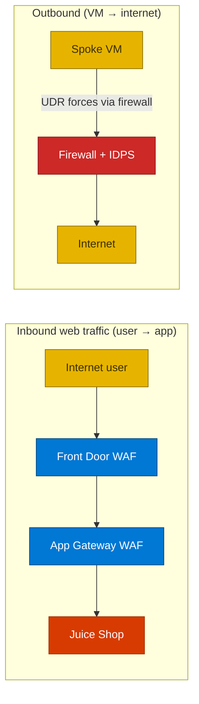

## Lab details

| Level | Persona | Duration | Purpose |
|-------|---------|----------|---------|
| 100 | Newcomer to Azure networking/security | 20 min | After this lab you can name every service in a defense-in-depth network and explain how inbound and outbound traffic is inspected. |

## Why this matters

**Defense-in-depth** means *layers of protection* — if one layer misses an attack, the next
one catches it. This module builds exactly that around a deliberately vulnerable web app.

## Networking building blocks

| Service | Plain language |
|---------|----------------|
| **Resource Group** (`rg-netsec-demo`) | A folder holding every resource; delete it to stop all billing |
| **Virtual Network (VNet)** | Your private network — a building. Here: one **hub** + two **spokes** |
| **Subnet** | A floor inside the building |
| **Hub-and-spoke** | A central hub connects to spokes; spokes don't talk directly to each other |
| **VNet peering** | The hallways connecting hub to each spoke |
| **NSG** | A basic subnet firewall (allow/deny rules); set to **deny by default** |
| **UDR / Route Table** | Overrides routing to force `0.0.0.0/0` through the firewall |

## Security services

| Service | Plain language |
|---------|----------------|
| **Azure Firewall Premium** (`NS-FW-demo`, `10.0.25.4`) | Managed firewall with **IDPS** + TLS inspection; sits in the hub |
| **Firewall Policy** (`NS-FWPolicy-demo`) | The rulebook (allowed FQDNs/ports) |
| **IDPS** | Inspects allowed traffic for attack signatures; here in **Alert** mode (logs, doesn't block) |
| **DDoS Protection** | Off in this lab (~$2,944/month) |

## Web delivery & protection

| Service | Plain language |
|---------|----------------|
| **OWASP Juice Shop** | A deliberately vulnerable app (safe to attack) — the thing we protect; runs on ACI |
| **Application Gateway WAFv2** (`NS-AG-WAFv2-demo`) | Regional web load balancer + WAF (OWASP 3.2, Prevention) |
| **Front Door Premium** (`NS-FD-demo`) | Global entry point (CDN + WAF, DRS 2.1, Prevention) in front of everything |

## Access & monitoring

| Service | Plain language |
|---------|----------------|
| **Azure Bastion** (`NS-BASTION-demo`) | RDP/SSH into VMs through the portal — no public IPs on the VMs |
| **Log Analytics** (`NS-LA-demo`) | Central log database, queried with **KQL** |
| **Diagnostic settings** | The "pipe" that sends a resource's logs to Log Analytics |

## Two paths to understand

## Test your understanding

1. In hub-and-spoke, can two spokes talk directly to each other?
2. What forces all VM outbound traffic through the firewall?
3. Which service lets you reach the VMs without any public IP?

  
Answers

1. **No** — spokes talk to the hub, not to each other (that isolation is the point).
2. A **User-Defined Route (UDR)** sending `0.0.0.0/0` to the firewall's private IP.
3. **Azure Bastion.**

## Summary of learnings

- Defense-in-depth = **layers**: two WAFs, firewall + IDPS, segmentation, forced tunneling, Bastion.
- **Inbound** goes through both WAFs; **outbound** is forced through the firewall.
- Everything logs to one **Log Analytics** workspace for evidence.
