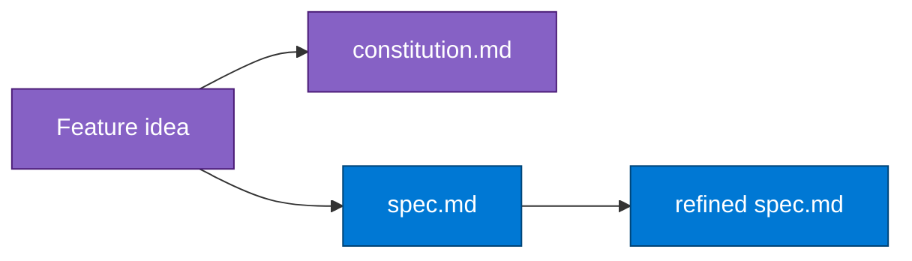

## Lab details

| Level | Persona | Duration | Purpose |
|-------|---------|----------|---------|
| 200 | Developer / architect | 30 min | Author a constitution and produce a clarified specification for a feature. |

## Why this matters

Everything downstream (plan, tasks, code) inherits from two artifacts you create here: the
**constitution** (the rules) and the **specification** (what to build). Get these right and
the rest of the pipeline stays consistent.

## Step 1 · Constitution

Define project-wide governance principles that every later artifact must honor.

```markdown
/speckit.constitution
```

This produces `.specify/memory/constitution.md`. Capture principles such as security
baselines, PaaS-first hosting, naming conventions, and testing standards. Review Copilot's
suggestions, tweak, then commit:

```bash
git add .specify/memory/constitution.md
git commit -m "Constitution prepared"
```

## Step 2 · Specify

Turn a natural-language feature description into a structured spec.

```markdown
/speckit.specify
```

Describe the feature in plain language (e.g., *"a tool that ingests Azure cost data on a
schedule and shows spend trends per resource group"*). Spec Kit generates `spec.md` with
user scenarios, requirements, and success criteria — and creates a feature branch with an
initial commit from the Specify template.

<div class="notice--info" markdown="1">
Keep the spec **product-focused** — describe *what* and *why*, not implementation details.
The constitution and later steps handle the *how*.
</div>

## Step 3 · Clarify

Resolve ambiguities before planning.

```markdown
/speckit.clarify
```

Spec Kit reviews `spec.md`, surfaces open questions, and updates the spec with your answers.
This prevents wrong assumptions from propagating into the plan and code. Commit the result:

```bash
git commit -am "Specification clarified"
```

## What you have now



## Test your understanding

1. Where is the constitution stored?
2. Should a spec describe column types and API routes, or scenarios and requirements?
3. What does `/speckit.clarify` prevent?

<details markdown="block">
  <summary>Answers</summary>

1. `.specify/memory/constitution.md`.
2. **Scenarios and requirements** (product-focused) — not implementation detail.
3. Wrong **assumptions/ambiguities** from propagating into the plan and code.

</details>

## Summary of learnings

- The **constitution** sets rules every artifact must follow.
- `/speckit.specify` turns natural language into a structured `spec.md`.
- `/speckit.clarify` resolves ambiguity **before** planning begins.
