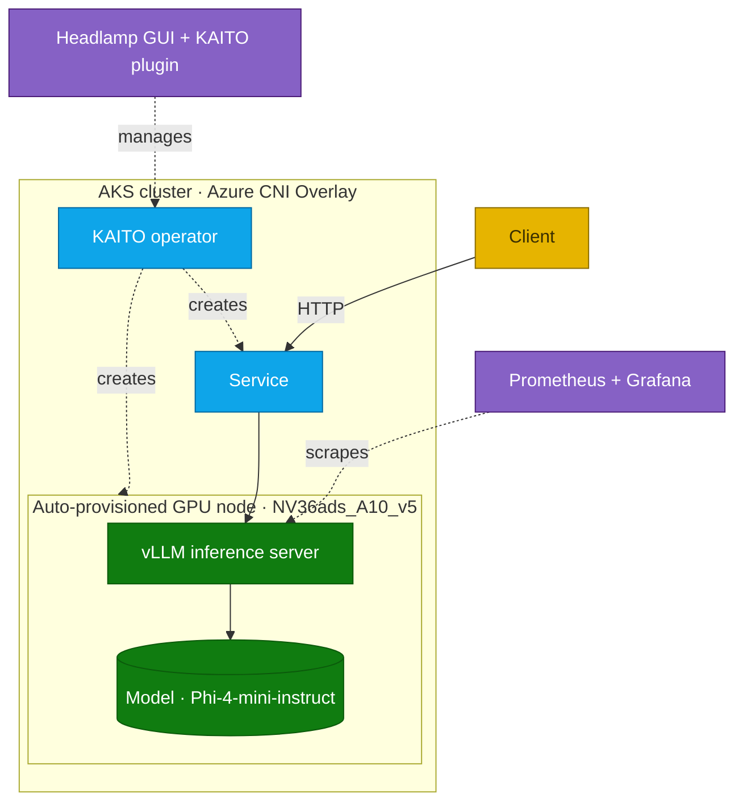

## Lab details

| Level | Persona | Duration | Purpose |
|-------|---------|----------|---------|
| 100 | Platform / AI engineer | 20 min | After this lab you can explain what KAITO automates and how a workspace becomes a running inference endpoint. |

## Why this matters

Serving an LLM on Kubernetes normally means provisioning GPU nodes, installing drivers,
downloading weights, deploying vLLM, wiring Services, and adding probes — hundreds of lines
of YAML. **KAITO** collapses all of that into a single **Workspace** custom resource.

## What KAITO does

KAITO (the **Kubernetes AI Toolchain Operator**) watches for a `Workspace` resource and
automatically:

1. **Provisions a GPU node pool** matching the requested instance type.
2. **Configures NVIDIA drivers** on the nodes.
3. **Downloads the model** weights.
4. **Deploys an optimized vLLM preset** inference server.
5. **Creates the Service / networking** and **health checks**.

*Choosing a model preset; KAITO handles GPU provisioning and serving. Source: Microsoft Learn.*

## Architecture

## Key design decisions

- **KAITO over manual vLLM** — a single CRD replaces 300+ lines of YAML.
- **Headlamp over kubectl** — visual workspace management for demos.
- **Azure CNI Overlay** — required for KAITO node auto-provisioning.
- **`Standard_NV36ads_A10_v5`** — a KAITO-supported GPU SKU with 24 GB VRAM.
- **Phi-4-mini-instruct** — a lightweight model ideal for a single A10.

## Test your understanding

1. What single resource type triggers KAITO to deploy a model?
2. Name three things KAITO automates.
3. Which networking mode is required for KAITO node auto-provisioning?

  
Answers

1. A **`Workspace`** custom resource.
2. Any three of: GPU node pool, NVIDIA drivers, model download, vLLM inference server, Service/networking, health checks.
3. **Azure CNI Overlay.**

## Summary of learnings

- KAITO turns a **Workspace** CRD into a fully provisioned GPU inference endpoint.
- It automates GPU nodes, drivers, model download, vLLM, networking, and probes.
- The demo serves **Phi-4-mini-instruct** on a single **A10** GPU.
