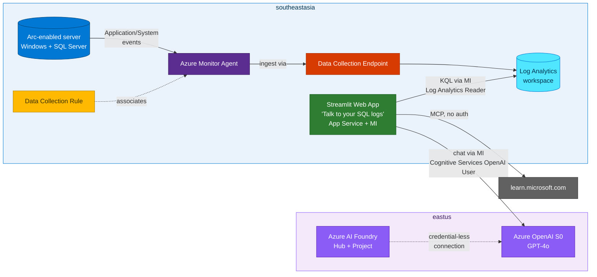

## Lab details

| Level | Persona | Duration | Purpose |
|-------|---------|----------|---------|
| 500 | Cloud / AI engineer | 20 min | Understand the end-to-end solution, the **AMA + DCE + DCR** log pipeline, and **Azure AI Foundry** — before you deploy it. Adapted from the [Analyze Your SQL Logs with Arc & AI](https://ibranibeny.github.io/AnalyzeYourSQLLogwithArc) workshop. |

## What you'll build

A natural-language SQL log-analysis system that:

- **Centralises SQL Server logs** — Azure Monitor Agent + a DCR stream Windows/SQL events to a **Log Analytics workspace**.
- **Answers questions in natural language** — **GPT-4o** turns *"errors in the last 24h"* into KQL and summarises the results.
- **References official docs** — the **Microsoft Learn MCP** enriches answers with documentation.
- **Eliminates secrets** — **managed identity** for every service-to-service call.

## End-to-end flow

## The 10 resources (one `deploy.sh`)

| # | Resource | Region |
|---|----------|--------|
| 1 | Resource group | southeastasia |
| 2 | Log Analytics workspace (PerGB2018, 30-day) | southeastasia |
| 3 | Windows VM + system-assigned managed identity | southeastasia |
| 4 | AMA extension + **DCE** + **DCR** + DCR association | southeastasia |
| 5 | Azure OpenAI (S0) + GPT-4o deployment (30K TPM) | eastus |
| 6 | **Azure AI Foundry** Hub + Project + credential-less OpenAI connection | eastus |
| 7 | App Service Plan (B1 Linux) + Web App + MI + RBAC | southeastasia |

## Key design decisions

- **Azure CLI over Bicep/Terraform** — lower barrier for workshop attendees.
- **Managed identity everywhere** — zero secrets in scripts or app settings.
- **GPT-4o for KQL generation** — natural language → Kusto queries.
- **Microsoft Learn MCP** — enrich answers with official documentation.

---

## Overview — DCE and DCR

Azure Monitor Agent (AMA) doesn't decide *what* to collect or *where* to send it. Two
resources do:

| Resource | What it is | Analogy |
|----------|-----------|---------|
| **Data Collection Endpoint (DCE)** | A regional ingestion endpoint AMA talks to; uniquely configures ingestion settings for a region. | The **post office** the agent drops mail at. |
| **Data Collection Rule (DCR)** | Defines the **data sources** (Windows events), optional **transformations**, and the **destination** workspace/table. | The **routing slip** that says what to collect and where to deliver it. |

**How a DCR flows data** — *data sources → input streams → data flows → destinations*:

*Source: Microsoft Learn — Structure of a data collection rule.*

For Windows machines the DCR `kind` is **`Windows`** with the **`windowsEventLogs`** data source
(stream `Microsoft-Event`) → the **`Event`** table. You pick logs/severities via **XPath**:

*Source: Microsoft Learn — Collect Windows events with Azure Monitor.*

View all DCRs from **Monitor → Data Collection Rules**:

*Source: Microsoft Learn — Monitor virtual machines: collect data.*

**Why Arc matters here.** AMA can only collect from a **non-Azure / on-premises** machine once
it's an **Arc-enabled server** — the Connected Machine agent creates the **managed identity**
AMA uses to authenticate (the legacy Log Analytics agent used a workspace key; AMA does not).
That's exactly what the **Azure Arc module** set up. Order is always **onboard to Arc → install
AMA → associate a DCR**. 
Ref: [Use AMA on-premises & other clouds via Azure Arc](https://learn.microsoft.com/azure/azure-monitor/agents/azure-monitor-agent-supported-operating-systems#on-premises-and-in-other-clouds).

---

## Overview — Azure AI Foundry

**Microsoft Foundry** is a unified Azure platform for building AI apps and agents. It groups
**models** (e.g. GPT-4o from the model catalog), **tools**, and **projects** under one resource
with built-in RBAC, tracing, and evaluations. An agent combines three parts:

*Source: Microsoft Learn — What is Microsoft Foundry Agent Service.*

| Component | Role in this workshop |
|-----------|----------------------|
| **Model** | GPT-4o turns your question into a **KQL query** and summarises the results. |
| **Instructions** | System prompt with the `Event` table schema so answers are grounded. |
| **Tools** | **Log Analytics** (run KQL) + **Microsoft Learn MCP** (cite official docs). |

The **AI Foundry project** holds the **credential-less connection** to Azure OpenAI and is where
you'd later add **evaluations** and **tracing** for the KQL-generation prompt.

## Summary of learnings

- The solution is **Arc → AMA + DCE + DCR → Log Analytics → GPT-4o + Foundry → Streamlit app**.
- **DCE** is the regional ingestion endpoint; the **DCR** decides what/where; both live in the workspace region.
- **Azure AI Foundry** unifies the model, connection, and (later) evaluations/tracing.
- Everything authenticates with **managed identity** — no secrets.

Next: **[Deploy the infrastructure](../71-deploy-infrastructure/)**.
