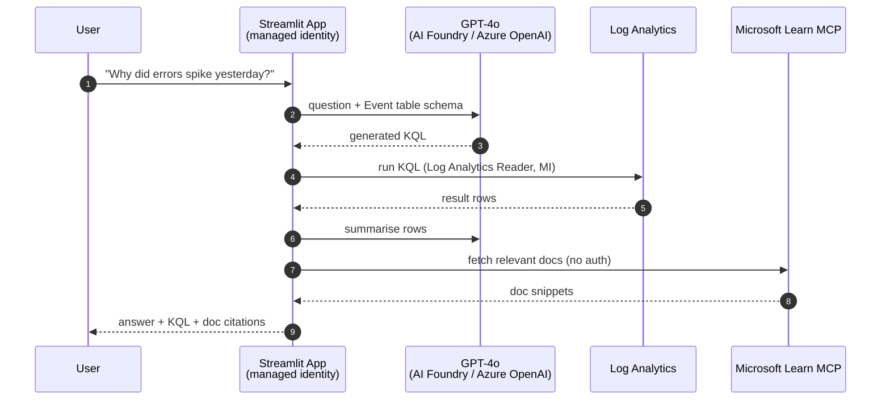

## Lab details

| Level | Persona | Duration | Purpose |
|-------|---------|----------|---------|
| 500 | Cloud / AI engineer | 25 min | Deploy the **Streamlit** app, confirm its **managed-identity RBAC**, and ask natural-language questions answered by **GPT-4o** (via the AI Foundry project) grounded in **Microsoft Learn**. |

## How a question is answered



## Step 1 — Deploy the Streamlit app code

The infrastructure created the Web App but **not** the app code. Deploy it:

```bash
source .env
cd streamlit-app
zip -r ../deploy.zip . -x "*.pyc" "__pycache__/*" ".env"
az webapp deploy -g "$RESOURCE_GROUP" -n "$WEBAPP_NAME" --src-path ../deploy.zip --type zip
cd ..
```

## Step 2 — Verify managed-identity RBAC (no secrets)

```bash
APP_MI="$(az webapp identity show -g "$RESOURCE_GROUP" -n "$WEBAPP_NAME" --query principalId -o tsv)"
az role assignment list --assignee "$APP_MI" \
  --query "[].{Role:roleDefinitionName, Scope:scope}" -o table
```

Expected:

| Role | Scope |
|------|-------|
| **Cognitive Services OpenAI User** | the Azure OpenAI account |
| **Log Analytics Reader** | the Log Analytics workspace |

<div class="notice--info" markdown="1">
`DefaultAzureCredential` in the app acquires tokens from the **system-assigned managed identity** —
there are **no API keys** in app settings or code. If you see `AuthorizationFailed`, wait ~5
minutes for RBAC propagation and restart: `az webapp restart -g "$RESOURCE_GROUP" -n "$WEBAPP_NAME"`.
</div>

## Step 3 — Talk to your SQL logs

Open `https://<WEBAPP_NAME>.azurewebsites.net` and ask, for example:

- *"How many errors were logged in the last 24 hours, grouped by source?"*
- *"Show the most recent SQL Server login-failure events."*
- *"Why did errors spike yesterday, and what does Microsoft Learn recommend?"*

Under the hood: **GPT-4o** (through the AI Foundry project connection) writes KQL → the app runs
it against Log Analytics with its **managed identity** → GPT-4o summarises the rows and adds
**Microsoft Learn** citations via **MCP**.

CLI smoke test:

```bash
LAW_ID="$(az monitor log-analytics workspace show -g "$RESOURCE_GROUP" -n "$LAW_NAME" --query customerId -o tsv)"
az monitor log-analytics query --workspace "$LAW_ID" \
  --analytics-query "Event | where EventLevelName=='Error' | take 5 | project TimeGenerated, Source, RenderedDescription" \
  --timespan P1D -o table
```

## Step 4 — (Optional) Use the AI Foundry project

In the [Foundry portal](https://ai.azure.com), open your **project** to:

- Inspect the **credential-less connection** to Azure OpenAI.
- Add **evaluations** on the KQL-generation prompt (accuracy of generated queries).
- Enable **tracing** to see each model call and tool invocation end-to-end.

## Summary of learnings

- The app is **secret-free**: managed identity + least-privilege RBAC for both OpenAI and Logs.
- **GPT-4o** converts natural language ↔ KQL; **MCP** grounds answers in official docs.
- The **AI Foundry project** is where you evaluate and observe the AI behaviour over time.

Next: **[Production hardening & cleanup](../74-production-cleanup/)**.
