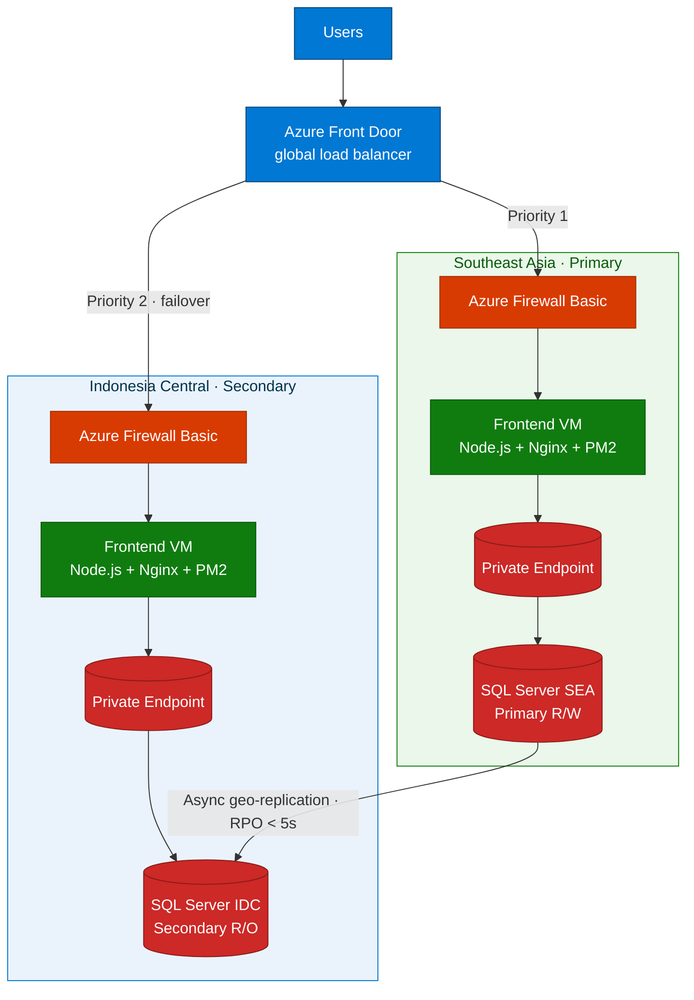

# Azure Resiliency & Disaster Recovery

**Simulate disaster recovery and automatic failover** between **Southeast Asia**
(primary / on-prem sim) and **Indonesia Central** (Azure cloud) using **Azure Front Door**,
**SQL Failover Groups**, and **hub-spoke** networking.

> **Goal:** When the frontend in Southeast Asia is stopped, Azure Front Door automatically
> switches traffic to Indonesia Central, with Azure SQL data synchronized via Failover
> Groups — **zero application code changes required**.

## Key components

| Component | Role |
|-----------|------|
| **Azure Front Door** | Global load balancing with health probes |
| **Azure Firewall (Basic)** | Centralized DNAT & traffic inspection |
| **Hub-Spoke VNets** | Network segmentation & security |
| **Private Endpoints** | Secure SQL access without public IPs |
| **SQL Failover Groups** | Automatic geo-replication & failover |
| **Node.js app** | Simple social-media CRUD demo |

## What you will learn

- **L200** — The resiliency architecture: hub-spoke, Front Door, and failover groups.
- **L300** — Deploy the full multi-region topology with the Azure CLI.
- **L300** — How SQL Failover Groups and Private Endpoints keep data available.
- **L400** — Run the live failover demo (stop primary → auto-failover → recover).

## Prerequisites

- **Azure CLI 2.60+**, Bash 4.0+, Git 2.30+, and an SSH key pair.
- An Azure subscription with capacity in **`southeastasia`** and **`indonesiacentral`**.
- The [azure-resiliency-workshop repo](https://github.com/ibranibeny/azure-resiliency-workshop).
