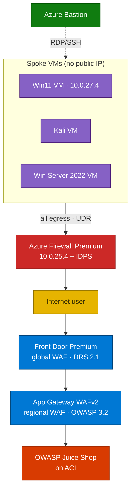

# Azure Network Security — Defense-in-Depth

Build a small but realistic **defense-in-depth** network in Azure: a **hub-spoke** topology
with **two WAF layers** (Front Door + Application Gateway), **Azure Firewall Premium + IDPS**,
**default-deny** segmentation, **forced tunneling**, **Bastion-only** VM access, and
**centralized telemetry** — then run attack scenarios and prove each control fired.

## The five security ideas it proves

| Idea | Plain language |
|------|----------------|
| **Web Application Firewall (WAF)** | A bouncer that blocks web attacks (SQLi/XSS) before they reach the app |
| **Network segmentation** | Split the network into rooms so a problem can't spread |
| **Default-deny** | Block everything unless explicitly allowed |
| **Forced tunneling** | Send all outbound traffic through one inspected exit (the firewall) |
| **IDPS** | A camera on the firewall that recognizes attack patterns and alerts |

## How traffic flows

- **Inbound** (a user visiting the app): Front Door → App Gateway → Juice Shop — two WAF layers inspect it.
- **Outbound** (a VM browsing the internet): forced through the firewall by a UDR — firewall rules + IDPS inspect it.

## What you will learn

- **L100** — Defense-in-depth concepts and every service in plain language.
- **L300** — Build the whole lab, stage by stage, with idempotent PowerShell scripts.
- **L400** — Run 8 attack/defense scenarios (WAF blocks, FQDN filtering, IDPS, geo-block…).
- **L300** — Read the evidence in Log Analytics with KQL.

## Prerequisites

- **PowerShell 7+**, the **Az** module, and **Azure CLI**.
- An Azure subscription (VMs use **Bastion**; the app runs on **ACI**).
- The [network-security-workshop repo](https://github.com/ibranibeny/network-security-workshop).

**Cost:** Firewall Premium ≈ **$1.75/hr**, plus Front Door Premium and App Gateway WAFv2.
Everything lives in one resource group (`rg-netsec-demo`) — **tear it down when done**.
DDoS Protection is intentionally **off** (~$2,944/month).

