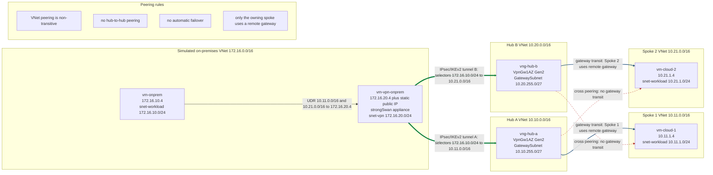

# Dual-Hub Site-to-Site VPN PoC - Architecture

**Date:** 2026-08-20
**Region:** Southeast Asia (`southeastasia`)
**Status:** Approved design; implementation and deployment not yet approved
**Scope:** Disposable learning PoC that simulates an on-premises site in Azure. This
document is the canonical architecture reference. It is not a production reference
architecture; every omission below is a deliberate, documented limitation.

This document is consistent with the approved design in
`docs/superpowers/specs/2026-08-20-dual-hub-vpn-poc-design.md`. If the two disagree, the
approved spec is authoritative.

## 1. Overview

One simulated on-premises network reaches two independent Azure hub-and-spoke
environments through two site-to-site (S2S) VPN tunnels. A single Linux appliance
(`vm-vpn-onprem`) running strongSwan terminates both IKEv2/IPsec tunnels. Each spoke uses
gateway transit only from its owning hub. Two additional cross-peerings demonstrate direct
VNet connectivity but deliberately provide no gateway transit, no remote-gateway use, and
no automatic failover.

Azure VPN Gateway S2S connections use IPsec/IKE, so strongSwan handles S2S termination.
strongSwan is the sole VPN implementation on the appliance; no other VPN software is
installed.

### Platform compatibility note

The original request specified `VpnGw1`. Effective November 1, 2025, new non-AZ
`VpnGw1-5` gateways can no longer be created, so the PoC uses `VpnGw1AZ` pinned to a single
availability zone (zone `1`) with a Standard static public IP. This preserves the approved
non-zone-redundant learning posture while using a currently deployable SKU. The Basic SKU
is not an option because gateway transit does not support Basic.

## 2. Topology

The canonical Mermaid source is `diagrams/dual-hub-vpn-poc.mmd`. Path styles:

- **Thick** (`==>`): the two IPsec/IKEv2 S2S tunnels.
- **Solid** (`-->`): the owning hub-spoke peering that provides gateway transit.
- **Dashed** (`-.->`): the cross-peering that provides direct VNet connectivity with no
  gateway transit.

## 3. Address plan

No address spaces overlap.

| Network | Address space | Subnet | Prefix | Fixed private IP |
|---|---|---|---|---|
| Simulated on-premises | `172.16.0.0/16` | `snet-workload` | `172.16.10.0/24` | `vm-onprem`: `172.16.10.4` |
| Simulated on-premises | `172.16.0.0/16` | `snet-vpn` | `172.16.20.0/24` | `vm-vpn-onprem`: `172.16.20.4` |
| Hub A | `10.10.0.0/16` | `GatewaySubnet` | `10.10.255.0/27` | Platform managed |
| Spoke 1 | `10.11.0.0/16` | `snet-workload` | `10.11.1.0/24` | `vm-cloud-1`: `10.11.1.4` |
| Hub B | `10.20.0.0/16` | `GatewaySubnet` | `10.20.255.0/27` | Platform managed |
| Spoke 2 | `10.21.0.0/16` | `snet-workload` | `10.21.1.0/24` | `vm-cloud-2`: `10.21.1.4` |

`GatewaySubnet` in both hubs receives neither an NSG nor a route table.

## 4. Peering model

VNet peering is **non-transitive**: a spoke reaches on-premises only through its own hub's
gateway, and a spoke can enable `Use remote gateways` on only one peering. There is
**no hub-to-hub** peering between Hub A and Hub B.

Four bidirectional hub-spoke relationships produce eight directional peering resources:

| Relationship | Hub-side flags | Spoke-side flags | Purpose |
|---|---|---|---|
| Hub A to Spoke 1 | Allow VNet access, allow forwarded traffic, allow gateway transit | Allow VNet access, allow forwarded traffic, use remote gateway | Primary tunnel path for Spoke 1 |
| Hub B to Spoke 2 | Allow VNet access, allow forwarded traffic, allow gateway transit | Allow VNet access, allow forwarded traffic, use remote gateway | Primary tunnel path for Spoke 2 |
| Hub A to Spoke 2 | Allow VNet access, allow forwarded traffic | Allow VNet access, allow forwarded traffic | Cross-peering; no gateway transit, no remote gateway |
| Hub B to Spoke 1 | Allow VNet access, allow forwarded traffic | Allow VNet access, allow forwarded traffic | Cross-peering; no gateway transit, no remote gateway |

Only **Spoke 1** uses **Hub A**'s remote gateway, and only **Spoke 2** uses **Hub B**'s
remote gateway. The two cross-peerings set neither `allowGatewayTransit` nor
`useRemoteGateways`; they exist purely to show direct VNet connectivity and provide no VPN
failover. Real dual-hub failover requires a different routing architecture, such as Azure
Virtual WAN or NVAs with BGP-based route control.

## 5. Routing and tunnel design

### On-premises user-defined routes

A route table is associated with `172.16.10.0/24` (`snet-workload`) only:

| Destination | Next-hop type | Next-hop address |
|---|---|---|
| `10.11.0.0/16` | Virtual appliance | `172.16.20.4` |
| `10.21.0.0/16` | Virtual appliance | `172.16.20.4` |

IP forwarding is enabled on the appliance NIC and in the Linux kernel. The appliance
forwards without SNAT so cloud workloads observe the true simulated on-premises source
address (`172.16.10.4`).

### Tunnels and traffic selectors

Each hub has a separate Local Network Gateway that references the appliance static public
IP and advertises only `172.16.10.0/24`. Routing is static; **BGP is not used**.

| Tunnel | Azure connection | Local (on-prem) selector | Remote (Azure) selector |
|---|---|---|---|
| Tunnel A | `conn-hub-a-onprem` (`vng-hub-a`) | `172.16.10.0/24` | `10.11.0.0/16` |
| Tunnel B | `conn-hub-b-onprem` (`vng-hub-b`) | `172.16.10.0/24` | `10.21.0.0/16` |

Each tunnel uses IKEv2, an independent pre-shared key, and dead peer detection (DPD).

### Cryptographic baseline

The Azure IPsec/IKE policy and the strongSwan configuration must match exactly. Exact CLI
property names are validated against the current Azure CLI before implementation.

| Phase | Encryption | Integrity | DH / PFS group | SA lifetime | SA data size |
|---|---|---|---|---|---|
| IKE (phase 1) | AES-256 | SHA-256 | DH group 14 | 28800 seconds | not applicable |
| IPsec (phase 2) | AES-256 | SHA-256 | PFS group 14 | 3600 seconds | 102400000 KB |

## 6. Identity and secrets

- Deployment uses an interactive Azure CLI identity obtained through `az login`. Managed
  identity does not replace the deployment identity.
- All four VMs receive system-assigned managed identities and SSH public-key authentication
  only.
- Two independent, random pre-shared keys (32 bytes each) are generated at runtime. They are
  never committed, printed, placed in deployment outputs, or written to parameter files.
- The keys are staged onto the appliance as root-only files under `/run/poc-vpn` (tmpfs) in a
  single Run Command payload, read as file contents rather than argument values, and shredded
  by `configure-vpn.sh` as soon as they have been written into `/etc/ipsec.secrets`
  (`root:root`, mode `0600`).

### 6.1 Key Vault deviation

The approved design stored the pre-shared keys in a dedicated RBAC-enabled Key Vault and had
the appliance managed identity read them through IMDS. **This was implemented and then
withdrawn**, because it is not workable in the target subscription.

Observed behaviour, with evidence:

| Step | Result |
| --- | --- |
| Vault `kvpoca58da106` created without any network settings | `publicNetworkAccess` came back `Disabled` |
| `az keyvault update --public-network-access Enabled --default-action Deny` | IP rule persisted; `publicNetworkAccess` reverted to `Disabled` |
| `az keyvault secret set` | `(Forbidden) ... ForbiddenByConnection` |

An Azure Policy `Modify` effect at the management-group scope (the SFI/MCAPS governance
pattern also applied to storage accounts in this tenant) forces `publicNetworkAccess=Disabled`
on new vaults. With public access disabled and no private endpoint, the Key Vault **data
plane is unreachable for every caller, managed identities included** — service endpoints do
not bypass this control, only private endpoints do.

Options considered:

| Option | Outcome |
| --- | --- |
| Private endpoint for the vault | The operator workstation still could not write the secrets, so the blocker remains. Rejected. |
| Subscription-scoped policy exemption | Matches the original design, but changes the governance posture of the subscription. Rejected for a disposable PoC. |
| **Remove Key Vault from the flow** | **Selected.** |

The security cost of this deviation is smaller than it first appears: the key material has to
cross ARM in *either* design, because the Azure end of each tunnel receives its shared key
through the `vpn-connection` resource. Key Vault only avoided a second exposure path, not the
primary one. What is genuinely lost is central rotation and audited secret access.

Honest statement of residual risk: the pre-shared keys transit the ARM request body for both
the connection resource and the Run Command payload, and may therefore appear in Azure
activity or Run Command diagnostics. This is acceptable for a short-lived PoC that is torn
down after the exercise. **It is not acceptable for production** — see section 11.

All four VMs still carry system-assigned managed identities.

## 7. Network security

NSGs default to denying unexpected inbound traffic.

- Appliance SSH TCP/22 is allowed only from the required operator CIDR.
- Appliance UDP/500 and UDP/4500 are restricted to the two Azure VPN gateway public IPs
  after those addresses exist.
- Cloud HTTP TCP/80 is allowed only from `172.16.10.0/24`.
- Cloud workload VMs (`vm-cloud-1`, `vm-cloud-2`) have no public IP addresses.
- `GatewaySubnet` receives neither an NSG nor a route table.

The PoC deliberately omits centralized inspection and private management services. These
choices are inappropriate for most production environments.

## 8. Diagnostics and monitoring

- A Log Analytics workspace receives the VPN gateway diagnostic categories available at
  deployment time (gateway, tunnel, route, and IKE diagnostics) plus `AllMetrics`. The
  implementation discovers supported categories rather than assuming every category exists.
- VMs use platform metrics and managed boot diagnostics.
- Azure Monitor Agent guest log collection is out of scope because the private cloud VMs
  have no explicit internet or private monitoring egress. This is a documented limitation.

## 9. Excluded services

The following are intentionally excluded to keep the PoC cost-focused and simple. Each is a
documented limitation, not a production recommendation:

- Azure Firewall
- Azure Bastion
- DDoS Network Protection plan
- NAT Gateway
- Active-active VPN gateways
- BGP
- Azure Virtual WAN
- Public IP addresses on cloud workload VMs
- DNS integration, certificate-based S2S authentication, and P2S client configuration

## 10. Known limitations

- The cross-peerings provide no gateway transit and no automatic failover; loss of a hub
  gateway isolates that hub's spoke.
- Single VPN appliance and single-zone gateways mean no high availability.
- Static routing with fixed selectors; no dynamic route exchange.
- No centralized inspection, private management plane, or guest-level monitoring.
- Pre-shared keys are not held in a managed secret store, so there is no central rotation and
  no audited secret access. See section 6.1 for why, and for the residual risk.

## 11. Production evolution

A production design should evaluate zone-redundant active-active gateways, two independent
on-premises appliances, BGP, Azure Firewall or Azure Virtual WAN, Azure Bastion, DDoS
Network Protection, explicit private egress, Azure Monitor Agent, alerting, tested failover,
and defined recovery objectives (RTO and RPO).

Secret handling must be restored before any production use. The supported way to satisfy the
governing policy is a **Key Vault private endpoint** in the appliance VNet plus a private DNS
zone for `privatelink.vaultcore.azure.net`, with the deployment pipeline running from inside
that network (for example a self-hosted agent or a jump host) so it can write the secrets.
That closes the gap described in section 6.1 without requesting a policy exemption.

Complete Workshop :
- [Dual-Hub Site-to-Site VPN Lab on Azure
](https://ibranibeny.github.io/azure-dual-hub-vpn-lab)

## 12. References

- [VPN Gateway SKU consolidation and migration](https://learn.microsoft.com/azure/vpn-gateway/gateway-sku-consolidation)
- [Hub-and-spoke network topology](https://learn.microsoft.com/azure/networking/design-guide/hub-spoke)
- [About VPN devices and IPsec/IKE parameters](https://learn.microsoft.com/azure/vpn-gateway/vpn-gateway-about-vpn-devices)
- [Create a site-to-site VPN connection](https://learn.microsoft.com/azure/vpn-gateway/tutorial-site-to-site-portal)
