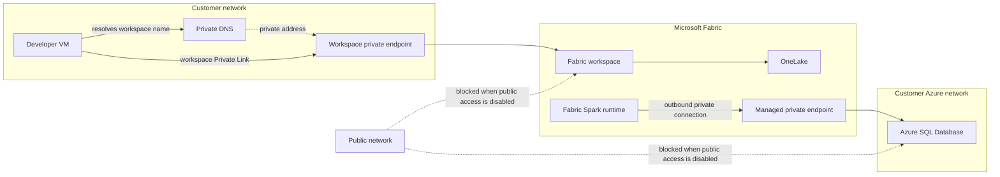

# Fabric Private Networking L400

Trace and validate two separate private-network flows for Microsoft Fabric: a client in a customer network accessing OneLake through workspace Private Link, and a Fabric Spark workload connecting outbound to an Azure SQL Database through a managed private endpoint. Follow the DNS resolution, endpoint, identity, and network boundaries for each path instead of treating a successful connection as proof that the design is secure.

## Architecture

## What you'll verify

- Resolve the workspace endpoint from the customer network and access OneLake over workspace Private Link.
- Inspect the workspace's managed private endpoint and test an Azure SQL connection from Fabric Spark.
- Compare each private-path test with a public-origin attempt; when public access is disabled, confirm that the public path fails.
- Distinguish network reachability and DNS issues from endpoint approval, identity, and database authorization.

Source/reference: [Fabric Private Networking L400 workshop](https://ibranibeny.github.io/workshops/fabric-private-networking-l400/)
