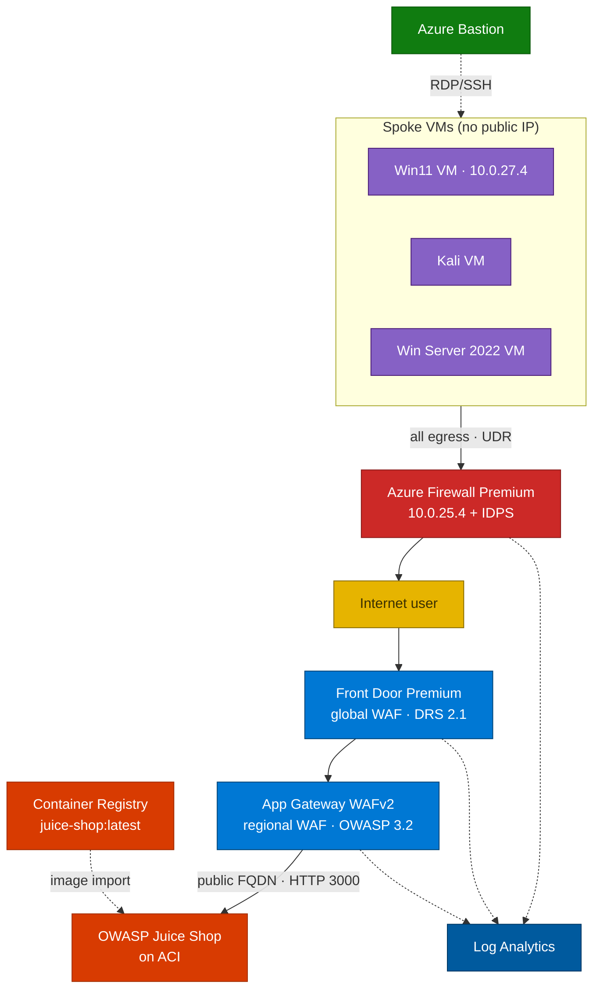

# Azure Network Security — Defense-in-Depth

Build a small but realistic **defense-in-depth** network in Azure: a **hub-spoke** topology
with **two WAF layers** (Front Door + Application Gateway), **Azure Firewall Premium + IDPS**,
**default-deny** segmentation, **forced tunneling**, **Bastion-only** VM access, and
**centralized telemetry** — then run attack scenarios and prove each control fired.

The full participant workshop — agenda, prerequisites, the six build modules, the nine
validation scenarios, the instructor guide, and the mandatory teardown — is published at
[ibranibeny.github.io/network-security-workshop](https://ibranibeny.github.io/network-security-workshop/).
It is derived from the Microsoft **Azure Network Security PoC** and the **NetSec Demo Lab**
template, deployed to **West US** with idempotent Azure PowerShell.

## The five security ideas it proves

| Idea | Plain language |
|------|----------------|
| **Web Application Firewall (WAF)** | A bouncer that blocks web attacks (SQLi/XSS) before they reach the app |
| **Network segmentation** | Split the network into rooms so a problem can't spread |
| **Default-deny** | Block everything unless explicitly allowed |
| **Forced tunneling** | Send all outbound traffic through one inspected exit (the firewall) |
| **IDPS** | A camera on the firewall that recognizes attack patterns and alerts |

## How traffic flows

- **Inbound** (a user visiting the app): Front Door → App Gateway → Juice Shop — two WAF layers inspect it.
- **Outbound** (a VM browsing the internet): forced through the firewall by a UDR — firewall rules + IDPS inspect it.
- **Evidence**: Front Door, App Gateway, and the firewall all stream diagnostics into one Log Analytics workspace.

> Juice Shop runs on **Azure Container Instances** (not App Service — sponsored subscriptions cap
> App Service VM quota at 0). The image is imported server-side into a private **Azure Container
> Registry** first, avoiding Docker Hub rate limits. ACI and ACR are public PaaS endpoints outside
> the VNets; App Gateway reaches the container over its public FQDN on port `3000`.

## Build modules

| Module | What it creates |
|--------|-----------------|
| `00-preflight` | Subscription pick/confirm, region/SKU/quota gate, resource group |
| `01-networking` | 3 peered VNets, subnets, public IPs |
| `02-security-core` | Firewall Premium + IDPS policy, default-deny NSGs, UDR, optional DDoS |
| `03-compute` | Win11 + Kali + Win Server 2022 VMs, Azure Bastion |
| `create-aci` | ACR image import + Juice Shop container backend |
| `04-app-delivery` | App Gateway WAFv2 + Front Door Premium |
| `05-monitoring` | Log Analytics + diagnostic settings |

## Validation scenarios (S1–S9)

| # | Scenario | Proves |
|---|----------|--------|
| S1 | WAF attack blocking | Layered L7 protection, Prevention mode |
| S2 | Firewall FQDN filtering | Outbound allow-listing via application rules |
| S3 | Default-deny segmentation | NSG deny-by-default + east-west control |
| S4 | Forced-tunnel egress | `0.0.0.0/0` UDR to the firewall |
| S5 | Outbound IDPS alert | Premium IDPS detection in `AZFWIdpsSignature` |
| S6 | Inbound IDPS via DNAT | Bidirectional inspection *(optional)* |
| S7 | Custom WAF rule | Custom rules complement managed OWASP sets *(optional)* |
| S8 | WAF geo-filtering | Geo-based access control *(optional)* |
| S9 | Telemetry evidence | Correlating allow/deny/block/IDPS events with KQL |

## What you will learn

- **L100** — Defense-in-depth concepts and every service in plain language.
- **L300** — Build the whole lab, stage by stage, with idempotent PowerShell scripts.
- **L400** — Run 9 attack/defense scenarios (WAF blocks, FQDN filtering, IDPS, geo-block…).
- **L300** — Read the evidence in Log Analytics with KQL.

## Prerequisites

- **PowerShell 7+**, the **Az** module, and **Azure CLI**.
- An Azure subscription (VMs use **Bastion**; the app runs on **ACI**).
- Quota for **≥ 6 vCPUs** of `Standard_D2s_v3` in `westus`.
- The [network-security-workshop repo](https://github.com/ibranibeny/network-security-workshop).

**Cost:** Firewall Premium ≈ **$1.75/hr**, plus Front Door Premium and App Gateway WAFv2.
Everything lives in one resource group (`rg-netsec-demo`) — **tear it down when done**.
DDoS Protection is intentionally **off** (~$2,944/month).

## Run the workshop

👉 **[Open the Azure Network Security Workshop ↗](https://ibranibeny.github.io/network-security-workshop/)**
— the published site carries the full agenda, per-module build guides, the S1–S9 validation
labs, the instructor guide, troubleshooting, and the mandatory teardown. The labs below are
the condensed, self-paced path through the same material.
