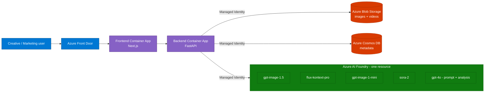
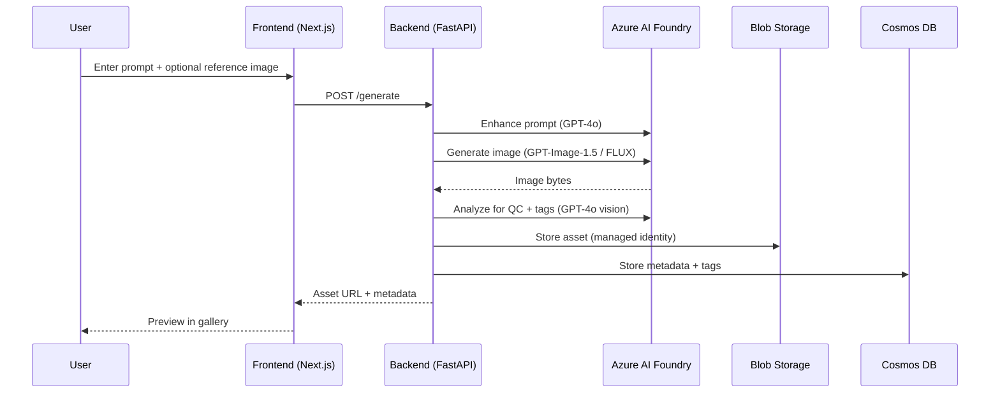

# Visionary Lab — Enterprise Content Generation on Azure AI Foundry

**Turn a prompt and a few reference images into publish-ready images and videos —
on-brand, keyless, and fully governed on Azure AI Foundry.**

Visionary Lab is a working, client-ready demo showing how marketing, brand, and
creative teams can produce high-quality visual content at scale using the latest
generative models (**GPT-Image-1.5**, **FLUX Kontext Pro**, **Sora 2**) unified
behind a single Azure AI Foundry resource — with **no API keys anywhere** (managed
identity end-to-end), an organized asset library, and AI-driven quality and brand
guardrails.

---

## 1. Persona, challenges & goals

**Primary persona — the Brand / Creative Content Lead** (with a supporting Marketing
Ops / Platform Engineer persona).

| # | Challenge today | What they want (goal) |
|---|-----------------|-----------------------|
| 1 | Campaign visuals (images + short videos) take days per asset through agencies or stock, and every localized variant restarts the cycle. | Generate first-draft, on-brand images and videos in **minutes**, then iterate by editing in place. |
| 2 | Consumer tools (public image/video generators) can't be used — data residency, IP, and brand-safety concerns. | An **enterprise-grade** capability running inside their own Azure subscription and tenant. |
| 3 | API keys for AI services get copied into notebooks, `.env` files, and CI — a security and audit nightmare. | **Keyless** access with least-privilege RBAC and a clean audit trail. |
| 4 | Generated assets end up scattered across drives and chats with no metadata, so nothing is reusable or searchable. | A **central asset library** with folders, automatic tagging, and search. |
| 5 | No consistent way to check whether an asset is actually usable (blurry, off-brand, wrong product depiction). | **AI-assisted QC** that scores quality, tags metadata, and flags brand/product issues. |

**One-line goal:** *Give creative teams a self-service studio that produces on-brand,
review-ready visual content in minutes — securely, inside Azure.*

---

## 2. High-level requirements

**Functional**

- Generate **images** from text, from reference images, or both (multi-model:
  GPT-Image-1.5 for face-preserving high-fidelity edits, FLUX Kontext Pro for fast
  high-fidelity generation, GPT-Image-1-Mini for rapid prototyping).
- Generate **videos** from text or text+image (image-to-video) with **Sora 2**,
  including synchronized audio, multiple resolutions (720p/1080p, landscape/portrait)
  and durations (4s / 8s / 12s).
- **Storyline → storyboard pipeline** — turn a one-line idea into a structured,
  multi-scene narrative and render every scene into on-brand frames.
- **Prompt enhancement** — refine user prompts to model best practices before
  generation (GPT-4o).
- **AI analysis / QC** — auto-analyze outputs for quality, generate metadata tags,
  and apply brand-protection guardrails for brand product imagery.
- **Asset library** — organize outputs into folders with automatic metadata.

**Non-functional**

- **Keyless security:** all service-to-service auth via **managed identity**
  (`DefaultAzureCredential`) — no API keys in code, config, or CI.
- **Least-privilege RBAC** scoped per service (Foundry, Storage, Cosmos).
- **Cloud-native & scalable:** container-based, scale-to-zero friendly hosting.
- **Single unified AI resource:** one Azure AI Foundry account hosting every model
  deployment.
- **Deployable in one command** via Azure Developer CLI (`azd up`).

---

## 3. Solution architecture

Visionary Lab is a two-tier app (Next.js frontend + FastAPI backend) on **Azure
Container Apps**, fronted by **Azure Front Door**. All AI models live in a single
**Azure AI Foundry** resource; assets go to **Blob Storage** and metadata to
**Cosmos DB**. Every connection uses **managed identity** — there are no keys.

**Why this shape**

- **Single Foundry resource** — one endpoint, one identity, one place to govern all
  model deployments (image, video, and LLM).
- **Managed identity everywhere** — the backend Container App's system-assigned
  identity is granted scoped RBAC on Foundry, Storage, and Cosmos. No secrets to
  rotate or leak.
- **Container Apps** — scale-to-zero friendly, no cluster to manage, one-command
  `azd` deploy.
- **Front Door** — global entry point, TLS, and custom domain for the frontend.

**Request flow (image example)**

---

## 4. The solution (walkthrough)

### 4.1 Image generation & asset library

One unified studio: browse the **asset library** (auto-tagged, folder-organized) and
generate new images from the persistent prompt bar at the bottom — pick the model
(**GPT-Image-1.5**, **FLUX Kontext Pro**, or **GPT-Image-1-Mini**), size, format, and
count, generate from **text / an input image / both**, then one-click **Enhance
prompt** before generating. Every output is auto-analyzed and tagged.

### 4.2 Video generation (Sora 2)

Text-to-video and **image-to-video** with synchronized **audio**, selectable aspect
ratio (16:9 / 9:16), quality (HD), and duration (4s / 8s / 12s). Generated clips land
in the video library with the same auto-analysis and tagging.

### 4.3 Storyline → Storyboard pipeline

Turn a one-line idea into a structured, multi-scene narrative (genre, tone, audience,
acts), then render every scene into on-brand frames — a repeatable pipeline for
campaign storyboards and explainer content. Each storyboard tracks its scene count
and render progress, and every scene carries its own text, image prompt, and
generated frame.

### 4.4 In-place image editing

Upload an image (PNG/JPEG/WebP up to 25MB) and edit it with natural-language
instructions — GPT-Image-1.5 preserves faces and supports high-quality edits.

### 4.5 AI analysis & quality control

Run custom, prompt-driven analysis on any asset — marketing effectiveness, composition,
color psychology, accessibility, brand consistency, and more — with ready-made quick
templates. This powers the automatic metadata tagging and brand-protection guardrails.

### 4.6 Keyless by design

No API keys anywhere. Locally the app uses your `az login` session; in Azure it uses
the Container App's managed identity via `DefaultAzureCredential`. RBAC is scoped
per service (Foundry, Storage, Cosmos).

---

## 5. Bill of Materials (BOM)

Everything needed to stand up the demo. Deploy with **`azd up`** — the Bicep in
`infra/` provisions all of it and wires the RBAC. *(No pricing shown.)*

### 5.1 Azure resources

| # | Component | Azure service | Purpose | Auth |
|---|-----------|---------------|---------|------|
| 1 | AI models | **Azure AI Foundry** (AIServices) | Hosts all image, video & LLM deployments | Managed Identity |
| 2 | Image/video storage | **Azure Blob Storage** | Stores generated assets (`images`, `videos` containers) | Managed Identity |
| 3 | Metadata | **Azure Cosmos DB** | Asset metadata, tags, analysis results | Managed Identity |
| 4 | Backend hosting | **Azure Container Apps** | FastAPI API (system-assigned MI) | System-assigned MI |
| 5 | Frontend hosting | **Azure Container Apps** | Next.js web app | System-assigned MI |
| 6 | Container Apps env | **Container Apps Environment** | Shared runtime for the two apps | — |
| 7 | Images | **Azure Container Registry** | Backend & frontend container images | Managed Identity |
| 8 | Global entry | **Azure Front Door** | TLS, custom domain, global routing to frontend | — |
| 9 | Observability | **Log Analytics workspace** | Container Apps logs/metrics | — |
| 10 | Networking | **Virtual Network** (+ private endpoints/DNS in Bicep) | Optional private connectivity | — |

### 5.2 Model deployments (in the single Foundry resource)

| Deployment | Model | Purpose |
|-----------|-------|---------|
| `gpt-4o` | GPT-4o | Prompt enhancement & AI analysis/QC |
| `gpt-image-1.5` | GPT-Image-1.5 | Primary image generation (face-preserving edits) |
| `gpt-image-1-mini` | GPT-Image-1-Mini | Fast image prototyping |
| `flux-kontext-pro` | FLUX.1-Kontext-pro | Alternative high-fidelity image generation |
| `sora-2` | Sora 2 | Video generation (with audio) |

> The app degrades gracefully — deploy a subset and unavailable models are skipped.

### 5.3 RBAC (least privilege, no keys)

| Identity | Role | Scope |
|----------|------|-------|
| Backend Container App (system MI) | Cognitive Services user | Azure AI Foundry account |
| Backend Container App (system MI) | Storage Blob Data Contributor | Storage account |
| Backend Container App (system MI) | Cosmos DB data-plane role | Cosmos DB account |

### 5.4 Build / deploy prerequisites

| Category | Requirement |
|----------|-------------|
| Tooling | Azure CLI, **Azure Developer CLI (`azd`)**, `uv` (Python), Node.js 19+ / npm, Git |
| Runtime | Python 3.12+, Docker (or `remoteBuild` in ACR) |
| Azure | Subscription with permission to create resources **and role assignments**; model quota for the deployments above |
| Deploy | `azd auth login` → `azd up` (prompts for a globally-unique AI Foundry name) |

---

## 6. How to demo it (suggested flow, ~15 min)

1. **Frame the pain** — show the persona table: days per asset, key sprawl, no library.
2. **Generate an image** — prompt + reference image, hit *Refine prompt*, generate with GPT-Image-1.5; regenerate a variant with FLUX to show model choice.
3. **Edit in place** — tweak the image with a follow-up instruction to show face-preserving editing.
4. **Generate a video** — text-to-video with Sora 2 (with audio); show the async job queue.
5. **Run the storyboard pipeline** — turn a one-line idea into a multi-scene storyline, then render the scenes into on-brand frames.
6. **Show governance** — open the gallery, point out auto-tags + QC analysis, then open the Azure portal to show **no keys** — just managed identity + scoped RBAC.
7. **Close** — one `azd up` deploys the whole thing into the customer's own subscription.
